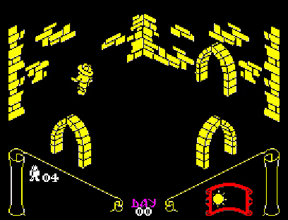
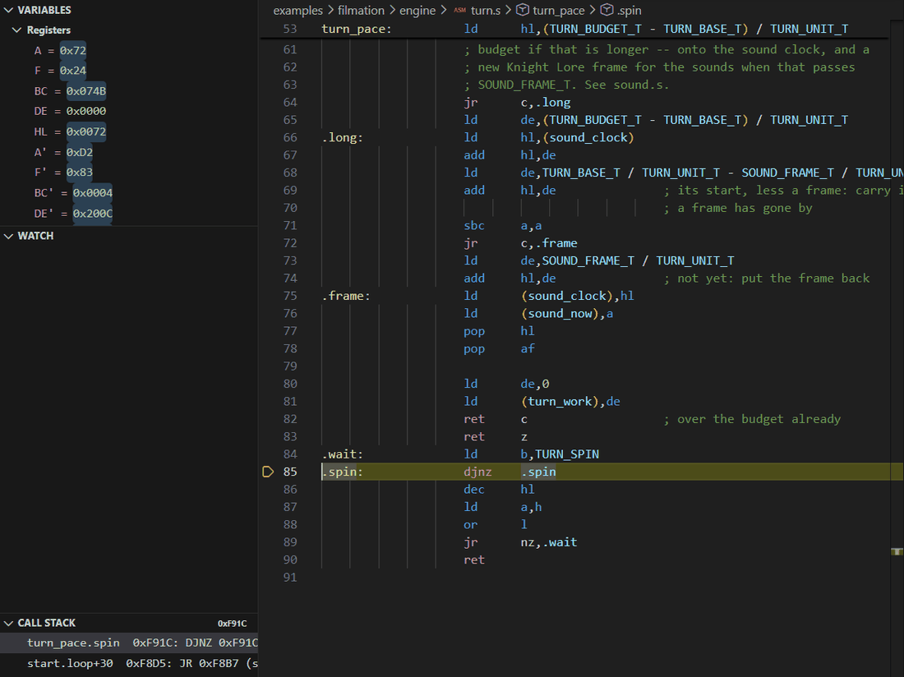
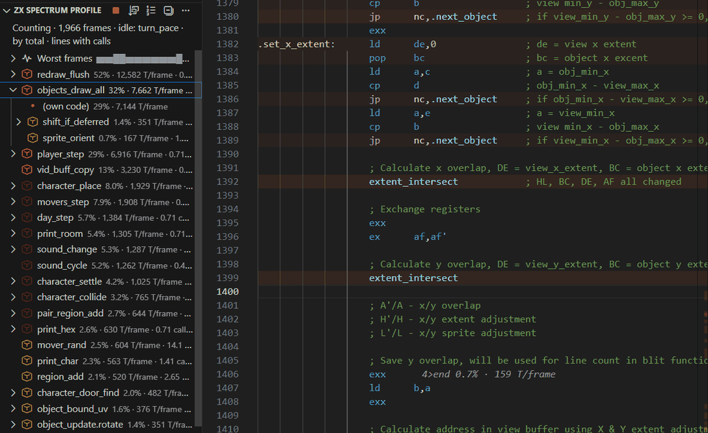
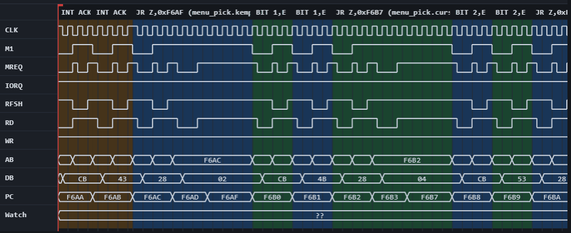
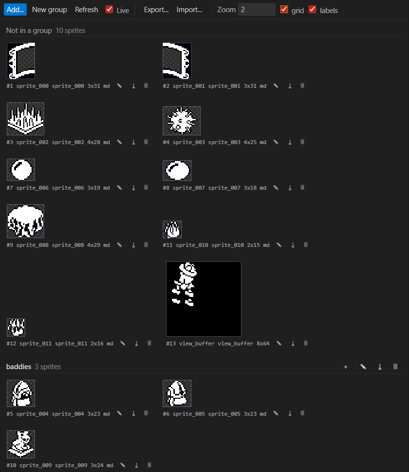

# zx-spectrum-emulator

A ZX Spectrum 48K/128K emulator for the two people most likely to want one
today: someone writing new machine code for the machine, and someone taking an
old game apart to find out how it worked.

The screen, the keyboard and the sound are all there — live, in a VS Code
panel, and streamed on an open port to anything else that wants them. What sits
behind them is the point: a debugger you drive from VS Code, over the
[Debug Adapter Protocol][dap], and the same machine exposed as tools an LLM
agent drives over [MCP][mcp] — both attached to the *same running Spectrum*, at
the same time. Set a breakpoint in the VS Code gutter,
then ask Claude to run until the sprite routine writes to the screen: your
breakpoint still catches it, VS Code's registers and call stack update on their
own, and neither side polls the other to find out.

[dap]: https://microsoft.github.io/debug-adapter-protocol/
[mcp]: https://modelcontextprotocol.io/



*Night falling on the Filmation engine's Knight Lore remake. The emulator
recorded this itself (the `start_video` tool), while an agent played it, and
brought nightfall on early by poking the day clock at `sun_x` mid-stride —
which is what having the machine on the end of an API is for.*

```
   VS Code                                  Claude, or any MCP client
   breakpoints, stepping,                   memory, breakpoints, keys,
   registers                                the screen, the profiler
        │ DAP                          MCP │
        ▼                                  ▼
   ┌──────────────────────────────────────────────┐
   │  Engine: one command queue, one emulation    │
   │  thread, ONE live Spectrum                   │
   └──────────────────────────────────────────────┘
                        │
        every change — a breakpoint hit, a register
        written, a key pressed — reaches both sides
```

## What it does that a normal emulator doesn't

- **Hands the machine to an agent.** Every debugging action is an MCP tool:
  read and write memory, set breakpoints and watchpoints, step, run, press
  keys, read the screen, record video, profile. An agent can hunt down the
  routine that draws the score and report back while you keep your own
  session — see [Connecting an MCP client](docs/mcp.md).
- **Runs backwards.** At any stop, step back an instruction, step back out of
  a routine, reverse-continue to the previous breakpoint, or run back to
  whatever last wrote an address — with the whole machine as it was, not a
  re-simulation. See
  [Stepping backwards](docs/vscode-debugging.md#stepping-backwards).

  

- **Shows where the time went.** A profiler counts each instruction's clock
  time and paints it onto your source as a heat map, with a call tree by call
  path and the worst frames kept in detail — idle time counted separately, so
  a pacing loop doesn't drown the real work. See
  [Execution profile](docs/vscode-debugging.md#execution-profile).

  

- **Records the bus half-clock by half-clock.** The Z80 core is pin-level and
  cycle-stepped, so the [cycle-by-cycle trace](docs/tracing.md) is simply that
  bus, written down: every address, every data byte, every control line.

  
- **Debugs the ROM as source.** `scripts/build_rom_source.py` reproduces the
  48K ROM **byte for byte** from a commented disassembly, so stepping into
  `PRINT` lands you in readable, annotated code — with your own
  sjasmplus-assembled program's symbols layered on top of it, not replacing
  it.
- **Treats graphics as graphics.** Find sprites in memory, name and group
  them, and export a sheet as a PNG with a TexturePacker-style JSON atlas or
  as `DEFB` source — and import it back.

  

**How accurate is it?** The Z80 is diffed instruction for instruction against
the vendored [floooh/chips](https://github.com/floooh/chips) `z80.h` and passes
ZEXALL and ZEXDOC in full; tape loading works at pulse level through the EAR
line, `.wav` and `.csw` recordings included. Memory contention and the +2A/+3
are not emulated — see [Status & roadmap](docs/status.md).

## What's actually emulated

- **CPU**: full Z80 core, cycle-stepped and pin-level, written in C++
  (`cpp-core/src/z80.cpp`) and diffed instruction-for-instruction against the
  vendored [floooh/chips](https://github.com/floooh/chips) `z80.h` reference,
  plus a full ZEXALL/ZEXDOC pass.
- **Memory**: the standard 48K map — 16K ROM (write-protected) + 48K RAM —
  or the 128K's: two ROMs and eight 16K banks paged through port `0x7FFD`,
  shadow screen and paging lock included. Which machine it is (`--machine`,
  or `machine` in a launch config) is a runtime choice; a snapshot switches
  it to whatever model the snapshot was taken on.
- **Display**: the ULA's screen decode (the classic interleaved-thirds bitmap +
  attribute layout), border color, and the ~50Hz frame interrupt.
- **Keyboard**: the full 8×5 matrix on port `0xFE`.
- **Sound**: the beeper, and on a 128K the AY-3-8912 (three tone channels,
  noise and envelope) on ports `0xFFFD`/`0xBFFD`, mixed into the same stream.
- **Snapshots**: `.sna` (48K and 128K) and `.z80` (versions 1-3, 48K and
  128K) loading and saving — registers, memory, border, and a 128K's paging
  and AY state.
- **Tape**: `.tap`, `.tzx`, `.wav` and `.csw` loading in the C++ core, at pulse
  level through the EAR line, with an optional fast-load trap on the ROM's
  LD-BYTES. The two audio formats are recordings, decoded back into pulses by a
  Schmitt trigger — see [Tape](docs/tape.md).
- **Disassembler**: the full documented Z80 instruction set (unprefixed, `CB`,
  `ED`, `DD`, `FD`, and `DD CB d`/`FD CB d`), including the well-known
  undocumented `IXH`/`IXL`/`IYH`/`IYL` register forms.

**Not emulated (yet):** the +2A/+3, memory contention / cycle-exact ULA timing,
and tape *saving*. See [Status & roadmap](docs/status.md).

Beeper audio (port `0xFE` bits 4 and 3) *is* emulated by the C++ core — see
[Audio](docs/audio.md).

## Why this architecture

- **One process, one live emulator, four front-ends.** `cpp-core/src/engine.h`
  owns the single `Spectrum` instance and is the *only* thing allowed to
  touch it. The MCP and DAP servers never call the core directly — they queue
  a command and wait on a future for the reply; the
  [screen stream](docs/vscode-debugging.md#live-screen-viewer) and the
  [audio stream](docs/audio.md) read it the same way, just repeatedly. The machine runs on its own thread and the
  queue serialises access to it, so every front-end always sees consistent
  state. Five things deliberately *bypass* the queue, because they have to
  work mid-run rather than at the next yield: pause, key presses, screen
  reads, trace control and the tape transport — see `engine.h`'s header
  comment for why each one.
- **Events, not polling.** The engine also fans out state-change events
  (`Stopped`, `Continued`) to every subscriber. If you tell it to `run` or
  `step` over MCP, your VS Code session gets an unsolicited `stopped` DAP
  event even though VS Code didn't ask for the change — and vice versa when
  you set a breakpoint by clicking the gutter.
- **The Z80 core is pin-level and cycle-stepped, not instruction-level.**
  The core is clocked once per half-T-state with a pin mask encoding the
  address/data/control lines, and every memory and I/O access passes through
  a bus you control. That's what makes T-state-accurate stepping, memory/IO
  watchpoints and the [cycle-by-cycle bus trace](docs/tracing.md)
  straightforward — the trace is simply that bus, recorded.
- **Shared state, live.** Because both front-ends drive the same `Engine`,
  you can set a breakpoint in VS Code, have an MCP client `run()` past other
  breakpoints and hit yours, and watch VS Code's UI update on its own — no
  polling, no manual sync. This is the actual point of the project.

## Tools on top of the emulator

The VS Code extension in `vscode-extension/` is more than the debugger's front
end:

- **Execution profiler.** Counts where the CPU's time goes while a program runs
  and paints it onto the source as a heat map, with a call tree by call path in
  the debug sidebar, idle time (a pacing loop, a `HALT`) counted apart, and the
  worst frames kept in detail -- see
  [Execution profile](docs/vscode-debugging.md#execution-profile). The same
  numbers are the `profile` MCP tool.
- **Watchpoints.** Stop the machine when the program reads or writes an address
  or a range, and hear what changed and which instruction did it -- see
  [Watchpoints](docs/vscode-debugging.md#watchpoints). VS Code's own Break on
  Value Change works too, and MCP clients get `set_watchpoint`.
- **Stepping backwards.** At a breakpoint or a pause, step back an
  instruction, back out of a routine, reverse-continue to the last breakpoint or
  run back to whatever last wrote an address, with the whole machine as it was --
  see [Stepping backwards](docs/vscode-debugging.md#stepping-backwards). MCP
  clients get the same through `step_back` and friends.
- **Z80 assembly editing.** sjasmplus syntax colouring, Go to Definition, Find
  All References, Rename, Call Hierarchy, hover documentation and the outline for
  `.asm`/`.s` files -- see
  [Editing Z80 assembly](docs/vscode-debugging.md#editing-z80-assembly).
- **Opening a program.** File -> Open a `.sna`, `.z80`, `.tap` or `.tzx` and it
  opens on a page showing the screen the snapshot or the tape's loading screen
  holds, what machine the program wants and what the tape contains, with Run and
  Debug buttons. The emulator is started if it isn't running, so a snapshot goes
  from Explorer to running machine in one double-click.
- **A graphics viewer** that reads sprites out of memory or a snapshot, names and
  groups them, and exports a sheet as PNG plus a TexturePacker-style JSON atlas
  or `DEFB` source -- and imports one back.
- **Panels** for the live screen, the cycle-by-cycle bus trace and the tape deck
  -- see [Debugging in VS Code](docs/vscode-debugging.md).

> ## The C++ core is the project
>
> `cpp-core/` is the only supported implementation. The original Python core
> (`zxspectrum/`, `cffi` around `z80.h`) is **deprecated**: still in the repo,
> but no longer developed, no longer verified, and no longer wired into
> `.vscode/` — every launch configuration targets the C++ server. (A
> from-scratch Rust core came in between; it has been removed, and lives on in
> the git history.) Tape loading, beeper audio
> and cycle-by-cycle bus tracing only ever existed in the C++ core.
>
> The `scripts/` helpers are still Python and still current — only the Python
> *emulator* is deprecated. For a clean install, follow
> **[INSTALL.md](INSTALL.md)**, which is C++-only throughout.

## Requirements

- **Windows 11** with [Build Tools for Visual Studio 2022](https://visualstudio.microsoft.com/visual-cpp-build-tools/)
  and its "Desktop development with C++" workload. CMake and Ninja come with
  that workload; `cpp-core/build.ps1` locates them and imports the MSVC
  environment itself, so no developer prompt is needed.
- **VS Code 1.85+**, for the debugging front end.
- A real 48K ZX Spectrum ROM image, 16384 bytes (16K) exactly, and for the
  128K its 32K ROM pair. Not included — see [ROM](#rom).
- **Python 3.10+ — optional**, and only for the helpers in `scripts/` (ROM and
  game disassemblies, tape generation). The emulator itself needs no Python.

Other platforms: `cpp-core` is portable C++17 with its platform-specific audio
and socket code `_WIN32`-guarded, so a Linux/macOS build is plausible — but it
is unverified, and `build.ps1`, the `.vscode/tasks.json` paths and the WASAPI
audio backend are all Windows-only.

## Setup

```powershell
cd cpp-core
.\build.ps1 -Release -Test     # RelWithDebInfo, then the fast test suite
```

That produces `cpp-core/build/RelWithDebInfo/zx_server.exe`, which is what the
VS Code tasks launch. A `Debug` build (plain `.\build.ps1`) lands elsewhere and
those tasks won't find it. `-Slow` runs the ZEXALL/ZEXDOC exercisers instead of
the fast suite — billions of emulated instructions, so pair it with `-Release`.

For the whole install end to end — ROM, build, the VS Code extension, first
launch and MCP — follow **[INSTALL.md](INSTALL.md)**, written as a checkable
step-by-step procedure.

## ROM

The emulator needs a genuine 48K Spectrum ROM to boot into BASIC — it isn't
included (it's Sinclair/Amstrad-copyrighted). Drop a 16384-byte ROM image at
`roms/48.rom` (the whole `roms/` directory except `.gitkeep` is gitignored,
so it never gets committed). You can verify a candidate file is the real
thing by checking its first byte is `0xF3` (`DI`, the first instruction of
every genuine Spectrum ROM).

For the 128K, put its two 16K ROMs concatenated — ROM 0 (the 128 editor and
menu) followed by ROM 1 (48K BASIC), the layout emulators call `128.rom` — at
`roms/128.rom`, 32768 bytes. Start the server with `--rom roms/128.rom
--machine 128`, or use the "ZX Spectrum 128" launch configuration. Amstrad,
who own the Spectrum ROMs, permit their distribution for emulation, so the
pair is easy to find (the Fuse emulator ships them as `128-0.rom` and
`128-1.rom`).

## Running

```powershell
.\cpp-core\build\RelWithDebInfo\zx_server.exe `
  --mcp-host 127.0.0.1 --mcp-port 8000 `
  --dap-host 127.0.0.1 --dap-port 4711 `
  --screen-host 127.0.0.1 --screen-port 8500 `
  --rom roms\48.rom
```

One process, one `Engine`, every server — MCP, DAP, the
[screen stream](docs/vscode-debugging.md#live-screen-viewer) and the
[audio stream](docs/audio.md) — sharing the one live machine. Normally you
don't run this by hand: the VS Code extension starts a server when a debug
session needs one and nothing is listening, and this repository's own launch
configurations start it from a `preLaunchTask` instead (see
[Connecting VS Code](docs/vscode-debugging.md)).

## Documentation

The detail lives in [docs/](docs/), one file per topic:

| Document | What's in it |
|---|---|
| [VS Code user guide](docs/vscode-user-guide.md) | Using the extension, task by task: the first session, the screen and keyboard, loading software, debugging your own program, watchpoints, stepping backwards, profiling, the graphics viewer and troubleshooting |
| [Connecting an MCP client](docs/mcp.md) | Pointing an agent at the running server, the full tool list, video and the `profile` tool |
| [VS Code settings reference](docs/vscode-settings.md) | Every `settings.json` setting, `launch.json` attribute and server-starting task the extension uses, with examples |
| [The graphics atlas](docs/graphics-atlas.md) | What the graphics viewer exports: the TexturePacker atlas, its `zx` keys, and reading one back |
| [Debugging in VS Code](docs/vscode-debugging.md) | The DAP front end: launch configs, live screen viewer, graphics and tape panels, the execution profiler, call stack, source-level debugging of the ROM and of your own programs, and editing Z80 assembly |
| [Game disassemblies](https://github.com/jonsole/zx-spectrum-disassemblies) | Manic Miner, Fairlight and Atic Atac &mdash; their own repository, checked out here as `game-disassemblies/` |
| [Fast tape loader](https://github.com/jonsole/zx-tape-loader) | A custom high-speed tape loader for the 48K, with an animated loading counter, and the Python that renders its tapes to WAV &mdash; its own repository, checked out here as `examples/zx-tape-loader/` |
| [Designing a Filmation room](examples/filmation/room-designer.md) | The room designer for `examples/filmation`, a VS Code extension of its own: what a room is made of, editing one in VS Code or in a browser, the collectables and the graphic map, and how the preview is held to the engine's own projection and depth sort |
| [Cycle-by-cycle bus tracing](docs/tracing.md) | Recording the bus half-clock by half-clock, the trace viewer, and how it compares against real silicon |
| [Audio](docs/audio.md) | Beeper emulation, sound as the master clock, backends and latency, stream format |
| [Tape](docs/tape.md) | Loading `.tap`/`.tzx`/`.wav`/`.csw`, the fast-load trap, and the loading sound |
| [Testing and performance](docs/testing-and-performance.md) | The test suites, ZEXALL/ZEXDOC, and measured throughput |
| [Project layout](docs/project-layout.md) | What lives where in the tree |
| [Status & roadmap](docs/status.md) | What is done, what is next |

Installing from scratch is a separate, checkable procedure: **[INSTALL.md](INSTALL.md)**.

## License

This project's own code has no license file yet. The vendored
`vendor/chips/z80.h` and `vendor/chips/z80_desc.yml` are
[floooh/chips](https://github.com/floooh/chips), zlib-licensed. No ROM image
is included or distributed — you must supply your own.
