# ZX Spectrum Debug for VS Code — user guide

Part of the [zx-spectrum-emulator README](../README.md).

The screenshots show the Knight Lore remake in `examples/filmation`, which the
**ZX Spectrum: Filmation** configuration runs.

This guide is for people who want to **run and debug Spectrum programs in VS
Code**: load a game or your own code, watch it on the screen panel, stop it,
step through it, and find out why it does what it does. It is organised by
task. Each section covers what you need day to day and links to the reference
pages for the full detail:

- [Debugging in VS Code](vscode-debugging.md) — how every feature works, and why.
- [VS Code settings reference](vscode-settings.md) — every setting and
  `launch.json` attribute.

**Contents**

1. [Before you start](#before-you-start)
2. [Your first session](#your-first-session)
3. [The screen panel](#the-screen-panel)
4. [Loading software](#loading-software)
5. [Debugging your own program](#debugging-your-own-program)
6. [Breakpoints, stepping and inspecting](#breakpoints-stepping-and-inspecting)
7. [Watchpoints: what wrote that?](#watchpoints-what-wrote-that)
8. [Stepping backwards](#stepping-backwards)
9. [Seeing what the display is doing](#seeing-what-the-display-is-doing)
10. [Finding where the time goes](#finding-where-the-time-goes)
11. [Looking at graphics data](#looking-at-graphics-data)
12. [Recording a bus trace](#recording-a-bus-trace)
13. [Editing Z80 assembly](#editing-z80-assembly)
14. [Joining a machine that is already running](#joining-a-machine-that-is-already-running)
15. [Troubleshooting](#troubleshooting)

---

## Before you start

You need three things. [INSTALL.md](../INSTALL.md) walks through each one,
with a check at every step:

1. **The emulator**, `zx_server.exe`, built from `cpp-core/`.
2. **A real Spectrum ROM** at `roms/48.rom`, and `roms/128.rom` if you want the
   128K. ROMs are not included, because they are copyrighted.
3. **This extension**, copied into your VS Code extensions folder.

Then open the **repository folder itself** in VS Code. The launch
configurations and tasks in `.vscode/` use paths relative to it, so they break
if you open a parent folder or a subfolder.

You don't start the emulator yourself. Starting a debug session, or opening a
snapshot, starts it if it isn't already running. It keeps running after the
debug session ends, so an MCP client (an AI agent, say) can keep using the same
machine, and it stops when you close the window. The **Spectrum** item in the
status bar shows it is running and has Stop, Restart and its log.

In another folder, VS Code needs to be told where the emulator is: set
**`zxspectrum.server.path`** to your `zx_server.exe` (see [Starting the
emulator](vscode-settings.md#starting-the-emulator)).

## Your first session

1. Open **Run and Debug** (Ctrl+Shift+D).
2. Pick **ZX Spectrum: Step through ROM** and press **F5**.
3. A terminal opens and shows the emulator being built and started. VS Code
   then connects, and the machine stops at the ROM's first instruction.
   (**Step through ROM (no build)** skips the build and starts the emulator
   that is already built.)
4. The **screen panel** opens beside your code.
5. Press **F5** (Continue). The screen shows `© 1982 Sinclair Research Ltd`.

That's the whole chain working. From here:

- **Pause** (F6) stops the machine wherever it is.
- **Stop** (Shift+F5) ends the debug session. The emulator keeps running.
- **F5** on any configuration starts again. It rebuilds the emulator if the
  code changed, and resets the machine.

Other configurations you can use straight after checkout:

| Configuration | What it runs |
|---|---|
| ZX Spectrum 128: Step through ROM | The 128K, booting to its menu |
| hello_rom_call example | A tiny program with source, for trying source-level stepping |
| Border rainbow example | A border-effect demo |
| Tape (fast load), Tape (real pulse load), Tape (waiting for LOAD) | Loading from a tape image |
| ZEXALL, ZEXDOC and the other Z80 tests | The CPU exercisers (uncapped speed, nothing to watch) |

The game configurations (Manic Miner, Fairlight and others) need files you
have to build or supply first. See
[INSTALL.md, step 7](../INSTALL.md#step-7--optional-extras).

## The screen panel

The panel shows the Spectrum's display, border included, and updates live as
the machine runs. It opens with every session. To reopen it, run
**ZX Spectrum: Show Screen** from the Command Palette (Ctrl+Shift+P).

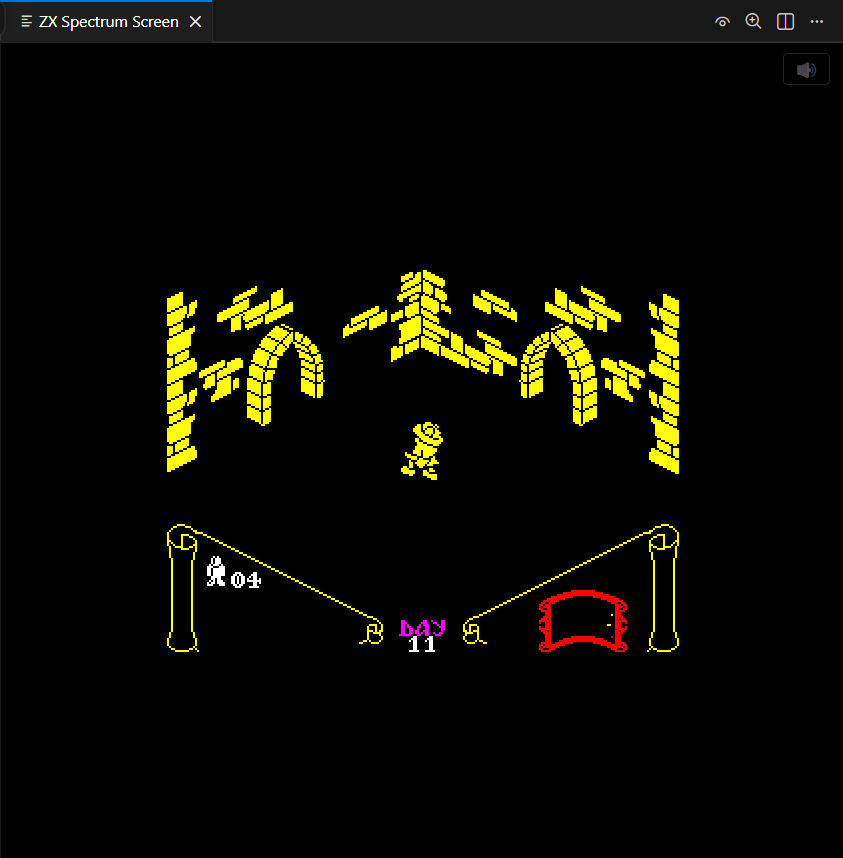
*The screen panel. Its title bar has the display-writes eye and the scaling magnifier; the speaker in the corner is the volume.*

### Typing on the Spectrum

**Click the screen panel first.** Keys only reach the Spectrum while the panel
has focus.

| PC key | Spectrum key |
|---|---|
| A–Z, 0–9, Space, Enter | the same key |
| Shift (either) | CAPS SHIFT |
| Ctrl (either) | SYMBOL SHIFT |
| ← ↓ ↑ → | CAPS SHIFT + 5, 6, 7, 8 (the cursor keys) |
| Backspace | CAPS SHIFT + 0 (DELETE) |

Keys go by physical position, so Shift+5 is CAPS SHIFT+5 whatever your
keyboard layout prints on that key. Punctuation is typed the Spectrum way,
with Ctrl as SYMBOL SHIFT: Ctrl+P is `"`, Ctrl+Z is `:`.

Keywords work as on a real 48K. In BASIC, pressing **J** at the start of a
line gives `LOAD`, and Ctrl+P then gives `"`.

### Sound and volume

The speaker icon in the panel's top-right corner mutes and unmutes. Hover over
it for a volume slider. The volume is remembered, and applies whether the sound
comes from the panel or from your PC's sound card (the repo's launch
configurations use the sound card).

Sound only plays at normal speed (1x).

### Size, sharpness, border and scanlines

The **magnifier** in the panel's title bar (or **ZX Spectrum: Screen
Scaling...**) sets how the picture is drawn:

- **Filter:**
  - *Nearest neighbour* gives crisp pixels.
  - *Sharp bilinear* gives crisp pixels that are all the same size at any
    panel size.
  - *Bilinear* gives a soft, TV-like picture.
- **Size:** fit the panel in whole steps (the default), fit it exactly, or a
  fixed 1x–4x.
- **Border:** how much of the border to show, from 100% (all of it) to 0% (the
  picture area only). A smaller border leaves room for a bigger picture.
- **Scanlines:** how dark the gaps between lines are, from off to 100%.

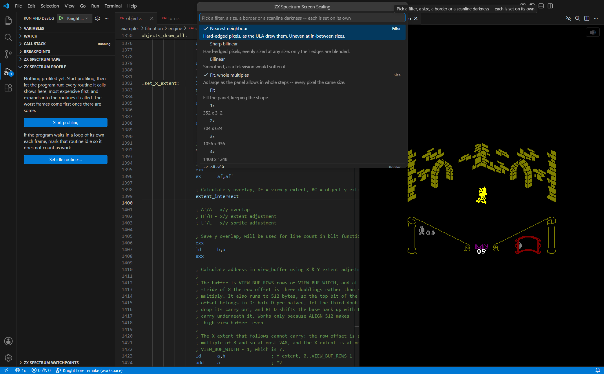
*The Screen Scaling picker. Each group (filter, size, border, scanlines) is set independently.*

The choices are saved as settings. See
[Scaling and filtering](vscode-debugging.md#scaling-and-filtering).

### Speed

The **speedometer** on the debug toolbar sets how fast the machine runs, and
the status bar shows the current speed:

- **1x** is a real Spectrum, and the only speed with sound.
- **2x**, **3x** and **5x** get through loading screens and slow sections faster.
- **1/2x** down to **1/1000x** give slow motion. At 1/50x the machine draws one
  frame a second, so you can watch a raster effect build line by line.
- **Uncapped** runs as fast as your PC can manage.

## Loading software

### Opening a snapshot or a tape

Open a `.sna`, `.z80`, `.tap` or `.tzx` file the way you open any file --
**File > Open**, or from the Explorer. It opens in a page that shows its
screen -- the picture saved in a snapshot, or a tape's loading screen -- and
says what it is (48K or 128K, what is on the tape), with two buttons:

- **Run** resets the emulator, loads the program and runs it.
- **Debug** does the same but stops at the program's first instruction.

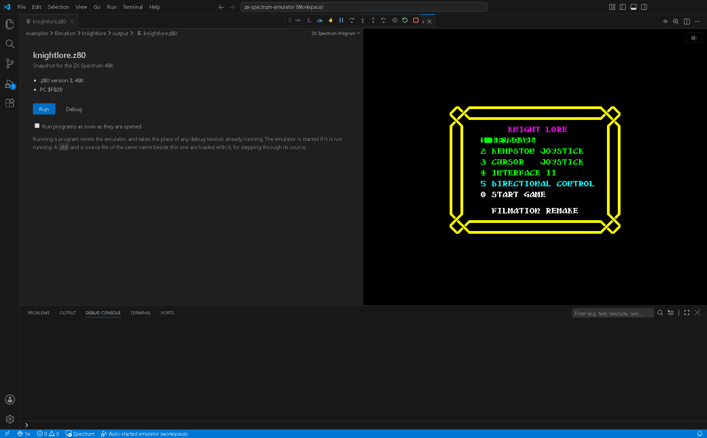
*Opening a snapshot. Run started the emulator and the game, in the screen panel on the right.*

Right-click a file in the Explorer for **Run in ZX Spectrum** and **Debug in
ZX Spectrum** without opening it. Tick *Run programs as soon as they are
opened* to skip the page.

A `.sld` with the same name beside the program, and a source file with that
name too, are loaded with it, so you can step through its source. A `.z80`
file that is really assembly source opens as text, as usual.

### Snapshots in a launch configuration

For a program you debug often, put its path in a launch configuration:

```json
{
  "name": "My game",
  "type": "zxspectrum",
  "request": "launch",
  "rom": "${workspaceFolder}/roms/48.rom",
  "snapshot": "${workspaceFolder}/snapshots/mygame.z80"
}
```

A 128K snapshot switches the machine to a 128K on its own. That needs the
128K ROM in `rom`.

### Tapes (`.tap`, `.tzx`, `.wav`, `.csw`)

- **At launch:** add `"tape": "path/to/game.tzx"`. By default the machine
  resets, types `LOAD ""` and plays the tape. `tapeAutoStart` and
  `tapeFastLoad` change that.
- **During a session:** run **ZX Spectrum: Load Tape...** and pick a file.

**Fast load** is on by default: ordinary tape blocks load instantly. Turbo
loaders and custom loaders always play in real time, as do `.wav` and `.csw`
recordings. Turn fast load off to see and hear a load the way it really
happened.

### The tape pane

**ZX Spectrum Tape**, in the Run and Debug sidebar, lists what is on the tape,
one block at a time:

- the file names from the headers;
- which block is playing now, with the ones already loaded dimmed;
- a clock icon on blocks that can't be fast-loaded.

The pane's title bar has Play/Stop, Rewind, a fast-load toggle, Load and
Eject. To jump to a block, hover over it and press its **target** button, then
press Play. That's how you replay one level of a multi-load game.

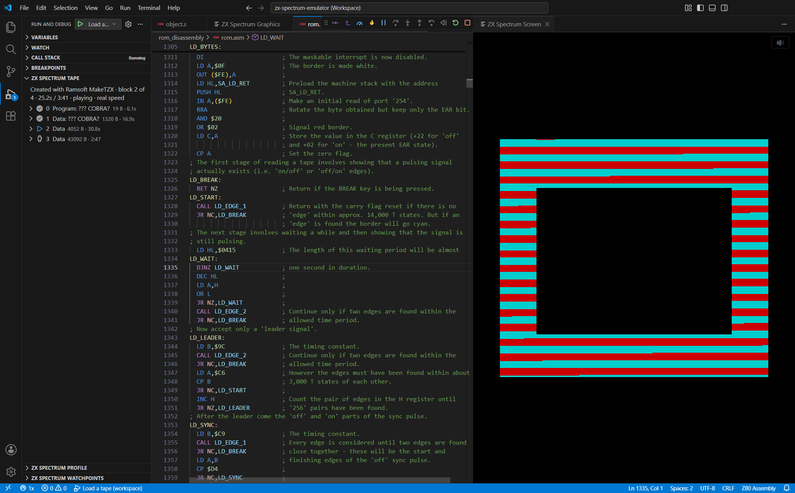
*A tape loading at real speed: block 2 of 4 is playing, the loaded blocks are ticked, and the loader's source is open.*

### The 128K

Use **ZX Spectrum 128: Step through ROM**, or add `"machine": "128"` and the
32K `roms/128.rom` to any configuration. The 128K has memory paging, the
128K's second screen, and the AY sound chip.

## Debugging your own program

Assemble with [sjasmplus](https://github.com/z00m128/sjasmplus) and its
`--sld` option. The `.sld` file maps addresses to source lines. Then add it,
and your entry source file, to the configuration that loads the program:

```json
{
  "name": "My program",
  "type": "zxspectrum",
  "request": "launch",
  "rom": "${workspaceFolder}/roms/48.rom",
  "snapshot": "${workspaceFolder}/build/myprog.sna",
  "sld": "${workspaceFolder}/build/myprog.sld",
  "asm": "${workspaceFolder}/src/main.asm"
}
```

With these files in place:

- **Stops open your source**, at the current line.
- **Breakpoints** can be set by clicking in the gutter.
- **The call stack** shows your routine names.

`asm` is only the **entry** file. Files it `INCLUDE`s are found beside it and
work the same way.

**Rebuild on every launch.** To assemble before each launch, make a task
that runs sjasmplus and name it as the configuration's `preLaunchTask`. The
emulator is still started for you. (**ZX Spectrum: Filmation** in the repo's
`launch.json` goes further, rebuilding the emulator too, with the
`filmation.build-and-start-server` task and a `debugServer`.)

**Stepping into the ROM with source.** Build the commented ROM disassembly
once ([INSTALL.md, step 7](../INSTALL.md#step-7--optional-extras)). From then
on, a `CALL` into the ROM steps into real, labelled source as well, with no
configuration needed. Without it, ROM code shows in VS Code's Disassembly View.

## Breakpoints, stepping and inspecting

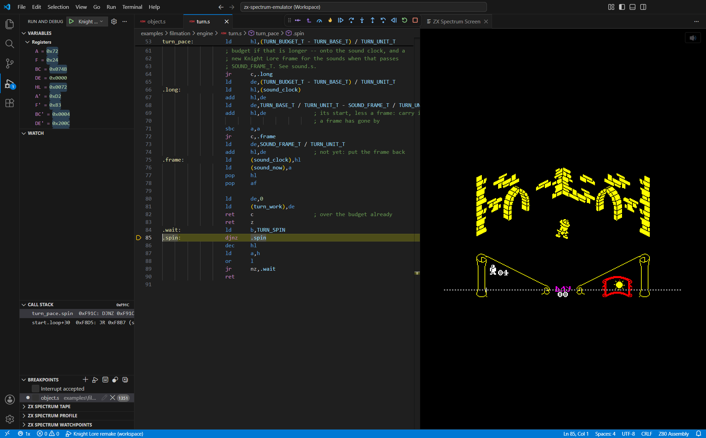
*Paused in a running game: the current source line, the Registers and Call Stack panes, and the screen panel beside them.*

- **Breakpoints:** click the gutter of a source file. Without source, set them
  in the **Disassembly View** instead.
- **Stepping:** Step Over (F10), Step Into (F11) and Step Out (Shift+F11), one
  Z80 instruction at a time.
- **Registers and flags:** the **Variables** pane has a *Registers* section
  (including the alternate set `AF'`, `BC'`, `DE'`, `HL'`) and a *Flags*
  section.
  - Double-click a value to change it.
  - A register accepts an address or symbol, such as `$8000` or `KEY_INT+9`.
  - A flag accepts `0`/`1` or `true`/`false`.
- **Memory:** open VS Code's memory inspector from a register (the binary icon
  beside it) to view and edit memory.
- **Call stack:** the call stack follows `CALL` and `RET` as they run, so each
  frame is a real call, labelled with its routine.

**Focus.** The repo's workspace settings stop VS Code jumping to the editor
every time the machine stops. You can keep typing in the screen panel while a
breakpoint or an agent stops the machine.

## Watchpoints: what wrote that?

A watchpoint stops the machine when the program reads or writes an address.

1. Run **Watch Address...**. It's in the editor's right-click menu, the Command
   Palette, and the eye icon on the **ZX Spectrum Watchpoints** pane.
2. Enter an address or a symbol, optionally with a length: `player 8`,
   `$5C3A,2`.
3. Choose what to stop on:
   - **Writes that change it** (the default)
   - **Every write**
   - **Reads**
   - **Reads and writes**

When it fires, the machine stops **on the instruction after** the access, and a
message says what happened:


*A watchpoint on `sun_x` has fired: the message in the Debug Console, and the watchpoint in the ZX Spectrum Watchpoints pane.*

```
player+2 ($F6DE) $00 -> $5E, written by object_update.on_screen ($CFF8)
```

Press **Step Back Into** once to see the machine just before the write.

The pane lists every watchpoint, including ones an MCP client set. Its eye
button disables a watchpoint without deleting it, and its cross deletes it.
VS Code's own **Break on Value Change**, in the memory inspector, works too.

Details: [Watchpoints](vscode-debugging.md#watchpoints).

## Stepping backwards

While stopped, you can go back through roughly the last minute of what the
machine did, with memory, registers and the screen exactly as they were.

| Control | Where it goes |
|---|---|
| **Step Back** (VS Code's button) | The previous instruction in this routine. A call that has just returned is skipped over, so it lands on the `CALL` |
| **Step Back Into** (← on the toolbar) | The previous instruction, whatever it was |
| **Step Back Out** (↑ on the toolbar) | The `CALL` that entered this routine |
| **Reverse Continue** (VS Code's button) | The previous breakpoint or watchpoint hit |
| **Run Back to Cursor** (editor right-click) | The last time execution reached that line |
| **Run Back to Last Write...** (editor right-click) | Just before the last write to an address |

While you're in the past, the status bar shows how far back you are, such as
*4.5 frames before live*.

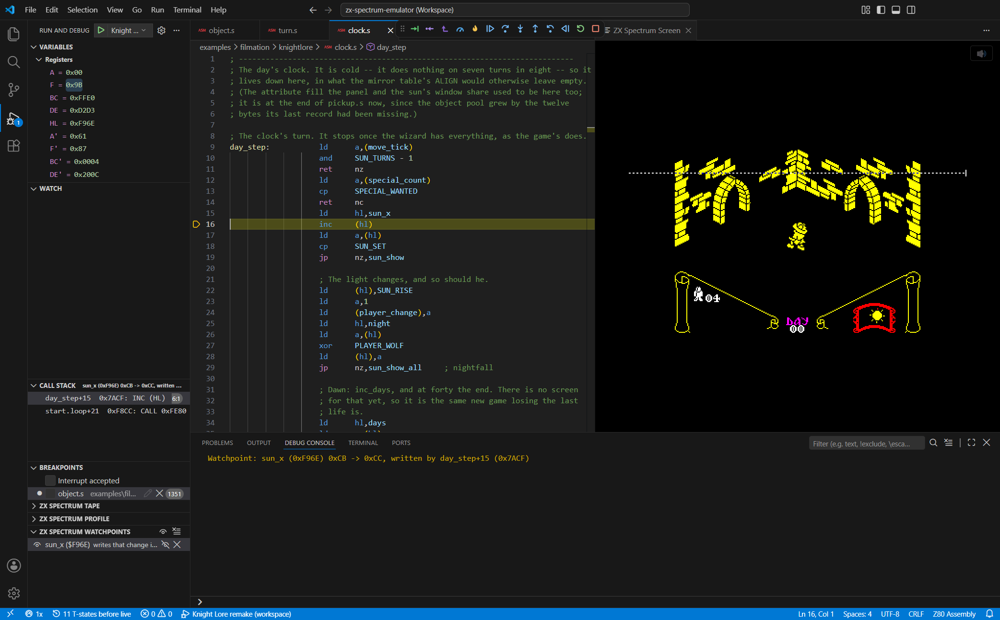
*One Step Back Into after that watchpoint: the machine is just before the `inc (hl)` that made the change, and the status bar says how far back it is.*

- **Running forward replays** exactly what happened: the same keys, tape and
  timing.
- **Return to Live** (→ on the toolbar, or the status bar item) jumps back to
  the present.
- **Changing anything in the past starts a new timeline.** That includes
  pressing a key, editing memory or a register, or using the tape. Everything
  after that point is thrown away.

The quickest way to find a bad value: set a watchpoint on it, then press
**Reverse Continue**.

Details: [Stepping backwards](vscode-debugging.md#stepping-backwards).

## Seeing what the display is doing

### Which bytes get drawn

The **eye** in the screen panel's title bar turns on **display writes**. The
picture dims, and every screen byte the program writes lights up on the frame
it was written in. It shows how much of the screen a routine actually redraws,
and what it touches.

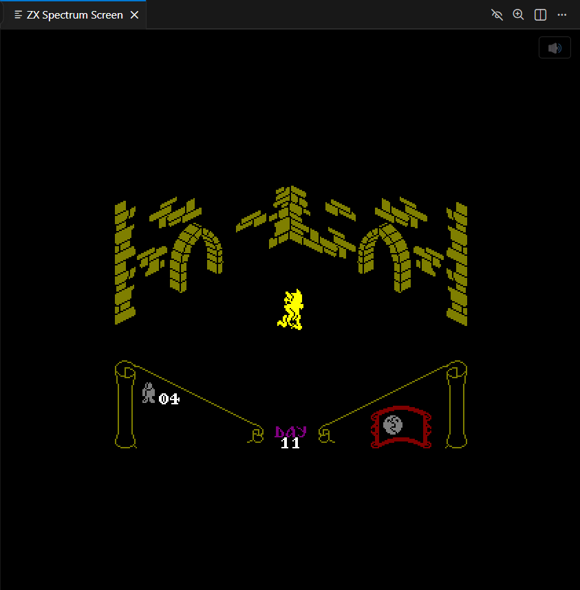
*Display writes on: only the knight, redrawn every frame, is lit; everything else is dimmed.*

- **Set Display Write Opacity...** sets how brightly a written byte shows.
- **Set Display Write Fade...** leaves a trail behind moving sprites. Its
  *never fades* choice shows every area that has ever been drawn to.

Details: [Display-write overlay](vscode-debugging.md#display-write-overlay).

### Where the beam is

While the machine is stopped, the screen panel shows where the TV beam has got
to in the current frame:

- **The raster marker:** a dashed line across the screen at the beam's line.
- **The frame in progress:** the current frame down to the beam, and the
  previous frame below it. A border colour change appears on the line where it
  happened as you step onto it.
- **Pending writes** (off by default): bytes already written to screen memory
  but not yet reached by the beam.

Toggle each from the Command Palette: *Show/Hide Raster Position*, *Show Frame
In Progress / Show Last Completed Frame*, and *Show/Hide Pending Display
Writes*.

Details: [Raster position](vscode-debugging.md#raster-position).

## Finding where the time goes

1. Press the **flame** on the debug toolbar (**Start Profiling**).
2. Play the part of the program you want to measure.
3. Your source lights up as it runs. Hot lines are tinted and labelled with
   figures such as `18% · 12,400 T/frame`.

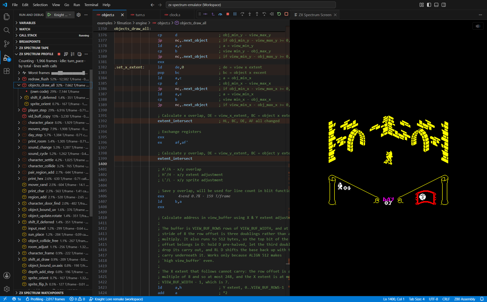
*The ZX Spectrum Profile pane, with a routine expanded into its own code and the routines it called. The pacing loop is marked idle.*

To dig further:

- **Hover** a tinted line for its exact figures.
- **Click the flame in the status bar** for a list of the most expensive
  routines and lines, and jump to one.
- Open the **ZX Spectrum Profile** pane in the sidebar for a call tree. It
  shows which routines called which, and what each call cost.
- Look at **Worst frames**, at the top of that pane, for the slowest frames.
  Click one to show just that frame on the source.

**Mark the waiting loop as idle.** If your program waits in a loop to keep
time, right-click that routine in the Profile pane and choose **Mark as Idle**.
Otherwise the waiting counts as work and hides everything else. A `HALT` always
counts as idle.

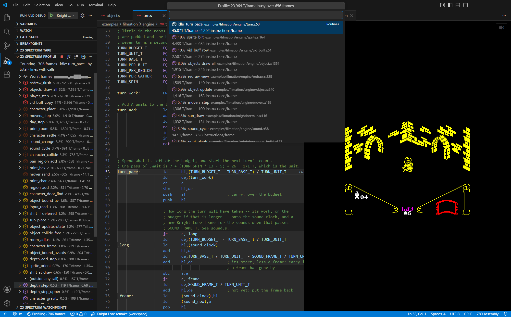
*Show Profile Hot Spots. Here the pacing loop is still counted as work, which is exactly what marking it idle fixes.*

**Stop Profiling** freezes the figures. **Start** again begins from zero.
Profiling doesn't pause the machine and barely slows it.

Details: [Execution profile](vscode-debugging.md#execution-profile).

## Looking at graphics data

**ZX Spectrum: Show Graphics** opens a panel that draws bytes the way the
Spectrum would, as sprites, a character set or a screen. It answers *is this
data right, and if not, which byte is wrong?*

### Adding graphics

1. Press **Add...**. A dialog opens with every setting on the left and a live
   preview on the right.
2. Choose where the bytes come from:
   - **Memory:** an address or a symbol in the running machine.
   - **File:** a `.scr`, a snapshot or any binary file.
   - **Selection:** `DEFB` lines selected in your source. You can also
     right-click a selection and choose **Show Selection as ZX Spectrum
     Graphics**.
3. Set the layout until the preview looks right:
   - **Width** (bytes across), **Height** (rows) and **Count**.
   - **Mask:** whether a mask byte sits before or after each data byte.
   - **Flip:** for data stored bottom row first.
   - **Header:** bytes to skip before each sprite.
   - **Colour:** a game that draws light on dark needs **Ink** white and
     **Paper** black, or its sprites show up inverted.
4. Give it a **Name**. One is suggested from the symbol or file.
5. Press **Add**, or **Cancel** to discard it.

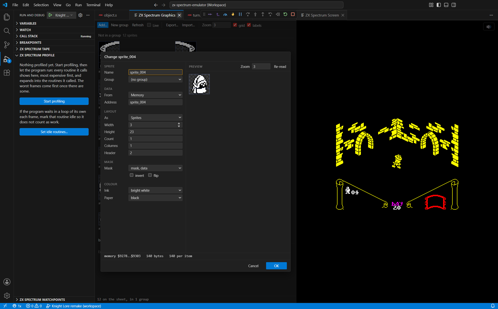
*The same dialog opens when you double-click a sprite to change it.*

### Checking the data

**Hover over any pixel.** The status line shows the address of the byte that
holds it, which bit, and the byte in binary.

### Arranging the sheet

- **Double-click** a sprite to change it in the same dialog.
- **Drag** sprites to reorder them.
- **New group** makes a named group. Drag sprites into it, or choose the group
  when adding. Rename a group by double-clicking its name.
- **Live** keeps sprites from memory updating while the machine runs.
  **Refresh** re-reads everything now.

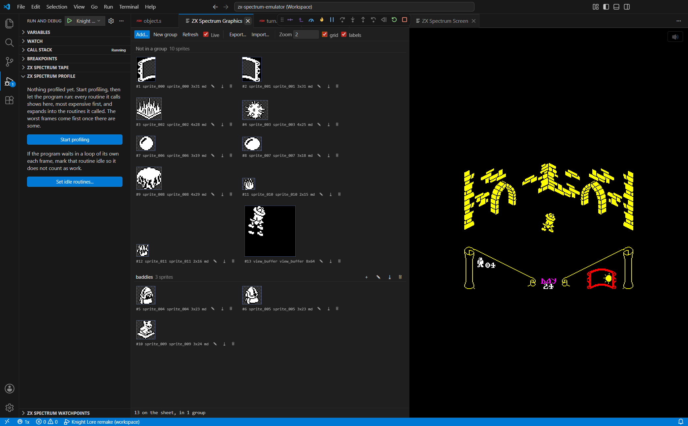
*Sprites from the Knight Lore remake, three of them in a group, and the game's 64×64 view buffer updating live.*

### Exporting for reuse

**Export...** saves the whole sheet. The **⤓** button on a group or a sprite
saves just that one. You choose from:

- **Atlas (`.json`), always written.** It uses the layout TexturePacker and
  Aseprite write, which game engines such as Phaser load directly. It also
  records each sprite's settings and where its bytes came from.
- **Picture (`.png`).** One pixel per Spectrum pixel, with masked pixels
  transparent.
- **Point into the snapshot.** The atlas records where the bytes are instead
  of copying them. Sprites from memory point into a `.sna` saved beside it.
- **Assembler source (`.s`).** `DEFB` lines that assemble back to exactly the
  same bytes, with a picture of each row in the comments.

**Import...** loads an exported atlas back onto the sheet.

Details: [Graphics viewer](vscode-debugging.md#graphics-viewer).

## Recording a bus trace

For timing-level problems, **ZX Spectrum: Show Trace** records the Z80's
buses, half a clock cycle at a time.

1. Open the panel and press **Record**.
2. Choose when to start: now, when execution reaches an address or symbol, or
   at a point in the video frame.
3. Choose when to stop: after a number of half-cycles, or at an address.
4. Press **Stop**, or let the stop point close the recording. The recording
   opens in the panel.

The panel has two views: a table, one band per instruction, and a timing
diagram of the Z80's signals and buses. Clicking in one moves the selection in
the other. The recording is saved as `live.zxtrace` in the workspace, so you
can keep it or open it again later.

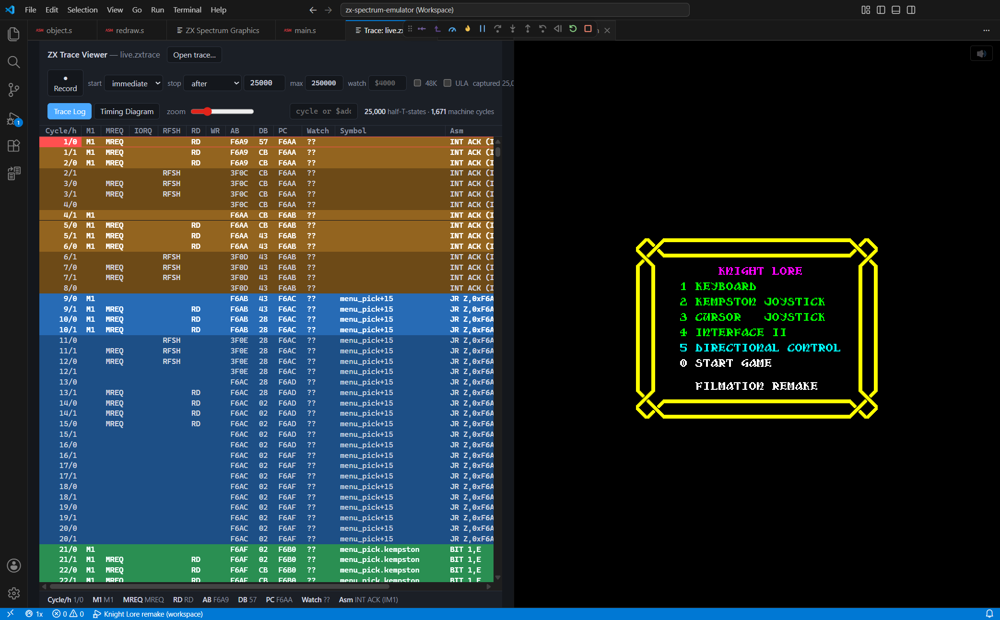
*The Trace Log.*

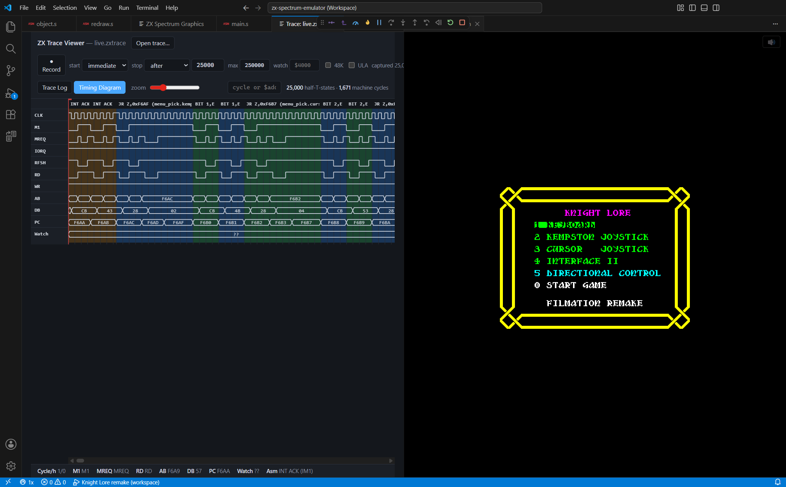
*The Timing Diagram of the same recording.*

Details: [Cycle-by-cycle bus tracing](tracing.md).

## Editing Z80 assembly

`.asm`, `.s` and `.a80` files open as **Z80 Assembly**, with sjasmplus syntax
colouring. This works without a debug session:

| Action | Key |
|---|---|
| Go to Definition | F12, or Ctrl+click |
| Find All References | Shift+F12 |
| Rename Symbol | F2 |
| Show Call Hierarchy | Shift+Alt+H |
| Go to Symbol in file / workspace | Ctrl+Shift+O / Ctrl+T |

Hover over a symbol to see its definition and the comment above it. The
Outline view lists the routines in a file, with each routine's local labels
under it.

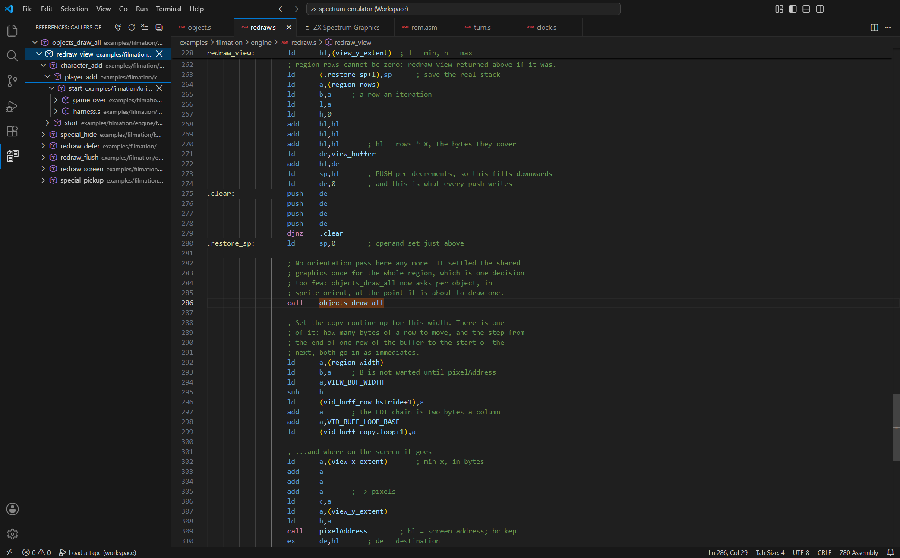
*Show Call Hierarchy, expanded three levels up from `objects_draw_all`.*

Details: [Editing Z80 assembly](vscode-debugging.md#editing-z80-assembly).

## Joining a machine that is already running

Every launch configuration **resets** the machine. To look at a machine that
is already running (one an AI agent started, or one left from an earlier
session), use **ZX Spectrum: Attach to running emulator** instead:

- It starts the emulator only if none is running.
- It never resets or rebuilds anything.

A launch configuration without a `debugServer` joins a running emulator in
the same way, but then resets it.

Add `sld` and `asm` to it to see your program's source.

The emulator can be shared with an MCP client (such as Claude Code) at the
same time. Both see and control the same machine. See
[Connecting an MCP client](mcp.md).

## Troubleshooting

| Problem | What to do |
|---|---|
| *Configured debug type 'zxspectrum' is not supported* | The extension isn't installed, or its folder is misnamed. Redo [INSTALL.md step 4](../INSTALL.md#step-4--install-the-vs-code-extension), then run **Developer: Reload Window** |
| *Could not find the ZX Spectrum emulator* | Set `zxspectrum.server.path` to your `zx_server.exe`, or open the emulator's repository with a build in `cpp-core/build/RelWithDebInfo` |
| *The ZX Spectrum emulator stopped as it started* | Run **ZX Spectrum: Show Emulator Log**. Usually a port already in use (change the `zxspectrum.server.*Port` settings) or a ROM it could not read |
| Launch hangs before connecting | Read the emulator's terminal. The usual causes are a build error, or another program using port 4711, 8000 or 8500 |
| Build fails with *LNK1168* | An emulator is still running and holds the file open. Stop it, then launch again |
| Keys do nothing | Click the screen panel so it has focus |
| Screen panel stays black | Check `roms/48.rom` is present: 16,384 bytes, first byte `F3`. An emulator started on other ports needs the `zxspectrum.server.screenPort` setting to match |
| No sound | Speed must be 1x, and the volume not muted |
| Breakpoints in `.asm` files are ignored | Open the repository root folder: its workspace settings allow breakpoints in assembly files |
| Stops show disassembly, not your source | Check `sld` and `asm` in the configuration. For the ROM, build the ROM disassembly |
| A game configuration fails on a missing file | Game files are built or supplied separately. See [INSTALL.md step 7](../INSTALL.md#step-7--optional-extras) |
| A panel is blank with no error | Focus it, run **Developer: Open Webview Developer Tools**, and read the console |

More in [INSTALL.md → Troubleshooting](../INSTALL.md#troubleshooting).
