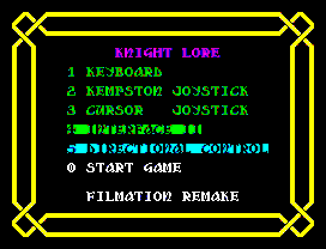

# filmation

A reimplementation of Ultimate Play The Game's "Filmation" engine — the
masked-sprite blitter behind isometric games like *Knight Lore*. Imported from
its own project tree (it was previously debugged under DeZog/CSpect); this copy
builds and runs against this emulator.



*Played in this emulator and recorded with its `start_video` tool.*

It comes in two parts: [`engine/`](engine/README.md), an isometric engine
with nothing of Knight Lore in it, and [`knightlore/`](knightlore/), the game
built on it. `knightlore/knightlore.s` joins the two -- it lays out memory
and includes both.

Two more games are built on the same engine. [`pentagram/`](pentagram/) is a
remake of Ultimate's *Pentagram*. [`knightlore128/`](knightlore128/README.md)
is Knight Lore on the 128K, with a bigger castle and Pentagram's graphics
beside its own; its README says how far it has got.

Unlike the other examples here it is a real, multi-file program, which is the
point of it being in the tree: the SLD it produces maps addresses into nearly
forty source files across two folders. That is exactly the case a single flat
line map gets wrong, and the regression tests in
`cpp-core/tests/symbol_tests.cpp` cover it.

## Build and run

Launch **"ZX Spectrum: Filmation"** from the Run and Debug view. The
`preLaunchTask` assembles it first, so editing any `.s` file and relaunching
runs what you just wrote. To build it by hand:

```powershell
.\.venv-win\Scripts\python.exe examples\filmation\knightlore\build.py
```

Add `--debug-room` to print the room number in the top-left corner, for
finding your way about; the ordinary build leaves it out.

The rooms themselves are edited in the room designer rather than by hand --
see [room-designer.md](room-designer.md). The designer is a VS Code extension
of its own, in [vscode/](vscode/), installed as that page describes. Each game's
`rooms.json` and `templates.json` are the editable form of its castle -- the
rooms, and the castle-wide templates they place -- and `build.py` turns the two
into `room_data.s`. Open `rooms.json` in VS Code for the room designer and
`templates.json` for the templates editor, or serve the rooms with
`python examples/filmation/vscode/room_designer.py`.

That needs `sjasmplus` — `tools/sjasmplus/sjasmplus.exe`, or anywhere on PATH.
It writes `knightlore/output/knightlore.z80`, a version 3 snapshot that
`build.py` wraps round the RAM the `SAVEBIN` at the bottom of
`knightlore/knightlore.s` saves, plus the `.sld` the debugger maps source
lines with and a `.lst` listing. `output/` is gitignored; everything in it is
regenerated.

What the repository carries of the games' own data is the JSON and the sprite
sheet; the packed forms and the font come from your own copy of the game, once,
before the first build:

```powershell
.\.venv-win\Scripts\python.exe examples\filmation\knightlore\kl_extract.py "path\to\Knight Lore.sna"
```

The release's example workspaces carry none of it, and make all of it with
`extract.py` instead, which runs the extractor and the steps after it and
checks what comes out against the game's `original.json` -- the hashes a right
copy gives:

```powershell
.\.venv-win\Scripts\python.exe examples\filmation\extract.py knightlore "path\to\your\copy"
.\.venv-win\Scripts\python.exe examples\filmation\extract.py pentagram "path\to\your\copy"
```

Both read a copy through `original.py`: a 48K `.sna` or `.z80` (versions 1 to
3), or for Pentagram, whose tape holds the game as it is, a `.tzx` or `.tap`.
Knight Lore's tape is decoded by its loader as it loads, so it needs a snapshot
-- load the tape in the emulator and use **ZX Spectrum: Save Snapshot...** at
the menu. The games flip sprites in place as they draw them and record it in
each sprite's width byte (bit 6 left to right, and in Pentagram bit 7 upside
down); `original.py` turns them back, so a snapshot need not be taken the
instant the game loads -- but it must be from before a game is played, which
changes the tables. A change to the carried data -- a room moved in the
designer -- stops the next release, since extraction could not reproduce it
(`original.json`'s `carried` hashes).

The unit tests assemble single files against stubs and run them headless --
the engine's in `engine/tests`, the games' in `knightlore/tests`,
`pentagram/tests` and `knightlore128/tests`, and one command for all of them:

```powershell
.\.venv-win\Scripts\python.exe examples\filmation\engine\tests\run_tests.py
```

## Source layout

`knightlore/knightlore.s` is the entry point. It holds the memory map and
includes the rest into it, the engine's files as `../engine/`:

| Region | What goes there |
|---|---|
| `$5B00` | Room building, and a little small code: `knightlore/room_build.s`, `engine/room.s`, `knightlore/glance.s`, `knightlore/end_at.s` |
| `$6000` | The castle's data: rooms, templates, pixel adjustments, the panel's pieces, the font, the collectables' tables, the shared rotation buffer, the sound effects |
| `$7400` | The view buffer, the object pool, the clock, the bit-reverse and sprite tables, and the pick-up code with `engine/screen.s` |
| `$8000` | The engine, the sprite bitmaps, the game's movers, the player, the sun |

`$5B00` to `$7FFF` is contended memory, where the ULA delays every access, so
what goes there is what can afford it: data read when a room is built, code that
runs only when a key is pressed, and a few small things that run every turn.
Each region ends with an `ASSERT` that it fits and a `DISPLAY` of the space it
has left.

**[engine/](engine/README.md)** is the engine: blit, projection, depth sort,
rotation arena, dirty-region redraw, collision, characters, movers, sound and
tunes, busy rooms and the joysticks. Its README lists what a game has to
supply.

**tools/** is what both games' build scripts share, rather than each keeping a
copy: the font pipeline lives there, and each game's `font_sheet.py` and
`font_source.py` say only what its own characters are.

**knightlore/** is the game:

| File | What it does |
|---|---|
| `knightlore.s` | The entry source: the memory map and the include list |
| `build.py` | Generates what needs generating, assembles `knightlore.s` and writes the `.z80` |
| `main.s` | The main loop: menu, a new game, a turn; the room being played |
| `player.s` | The knight: his record, entering and leaving rooms, dying, changing into the wolf |
| `knight.s` | His size, step, jump and doorway box, and the arch nudge |
| `glance.s` | His top half looking about as he goes |
| `movers.s` | Which template gets which behaviour, and which routine each behaviour is. The behaviours themselves are the engine's, in `engine/movers.s`; what is left here is the frames a guard wears, the hunting ball's two questions, how fast the repel spell comes, and the ghost's speeds |
| `shared_movers.s` | What it gives `engine/movers.s`: the steps, sounds and frames that make a pacer a fire, a hopper a ball, a paced pair a guard, a drifter a ghost, and the rest |
| `special.s`, `pickup.s` | The collectables and the cauldron; picking up, putting down, the carried objects |
| `room_build.s` | Decoding a room from the castle's templates; printing the day and lives |
| `sun.s`, `clock.s` | The sun and moon window, and day and night |
| `overlay.s` | What is drawn straight on the screen, put back over a redrawn region |
| `panel.s`, `panel_data.s` | The status panel |
| `menu.s` | The menu: the controls on offer, and its own tune |
| `end.s`, `end_at.s` | Game over, its two tunes and the notes they are made of, and the percentage of the castle seen. `engine/tune.s` plays them |
| `sound_fx.s` | The sound effects: which tone to play, and when -- including a fire's hum and its bounce, for the shared pacer |
| `busy.s`, `input.s` | What it gives `engine/busy.s` and `engine/input.s`: how slow a room has to be before its monsters take turns, and its own keys. The joysticks are the engine's |
| `tests/` | Unit tests for the movers and the arch nudge, run by `engine/tests/run_tests.py` |

The generated files and the scripts that make them are in `knightlore/` too --
see [The pipeline](#the-pipeline).

The blitter is one routine, patched for each sprite: `sprite_blit_setup` writes
in how many columns of a row land in the region and where the clipped ones end,
so nothing is decided per row. `sprite_jump_table` holds only the arithmetic
that turns a row count into a byte offset for each width. Most of the
cleverness is in address arithmetic, not control flow.

## Depth sorting

[depth.md](engine/depth.md) walks through `depth.s` routine by routine, with worked
examples; this section is the summary.

Draw order is a permanent invariant of the list, not something recomputed. When
an object moves it is unlinked and re-inserted in one pass; a zero step is
caught by `depth_add_step`'s test and goes no further. There is no sort.

This is Head Over Heels' design. Knight Lore instead rebuilds a list of dirty
objects every frame and repeatedly scans for one that nothing occludes, draws it
and restarts from the head — O(n²) at best, and since a "draw that one first"
decision discards the scan and restarts with a new candidate, O(n³) worst case,
bounded only by an 8-entry cycle stack.

**The comparator.** `depth_cmp` compares two solid boxes. On any floor axis
where they do *not* overlap, that axis's coordinate difference is part of the
key; where they do overlap the axis says nothing and contributes nothing. That
single rule is exactly Head Over Heels' seven-case dispatch table — their key is
always the sum over the non-overlapping axes — with no dispatch at all, and
interpenetration falls out as the empty sum.

Z is the exception: a separation in Z still says which box is nearer, but its
term is left out of the sum. The sum is only read when the separating axes
disagree, and when one of them is Z that is something above and behind
something else — the knight's body over the top of a table he is pushing —
where the floor is what the eye goes by.

The *signs* are ours, not theirs. `object_place` sends `+U` down the screen and
`+V` up it, so the projection's null direction — which for an orthographic
projection is the depth axis — is `(1,-1,1)`: `+U` and `+Z` are nearer, `+V`
further. Head Over Heels' `U + V + Z` comes from a projection where both floor
axes descend.

**Two answers.** `depth_cmp` returns an ordering (carry) and whether it is
*certain* (`A = 0`). It is certain when every axis that separates the boxes
names the same one as nearer — two agreeing axes are more certain than one, not
less. Axes that disagree, or none at all, leave a guess from the sum. The insert
scan needs the difference because isometric depth is genuinely non-transitive:
A in front of B in front of C in front of A is constructible, so there is no
total order to sort by. The scan's insertion point therefore *lags* its cursor:
a guessed ordering advances the cursor but is not trusted enough to commit to.

**The list is doubly linked purely so unlink is O(1).** The reverse chain is
never used for drawing. `PREV` does not point at the previous object — it points
at the `NEXT` *field* that points at us, which is that object's own address
(`NEXT` is at offset 0) or `object_list` itself for the head. That removes the
"am I the head?" branch from both unlink and insert. Never dereference it as a
record.

**The dirty gate** is the step itself. `depth_step` adds a step to `U`, `V`
and `Z` and re-sorts only if the step was not zero, so the question is asked at
the one moment the answer is known. It must be the step really applied, which
for a character is the clamped `D`/`E` rather than the record's spent `DU`/`DV`
— see [depth.md](engine/depth.md). It gates on the *world* position: the null
direction is `(1,-1,1)`, so `U+1, V-1, Z+1` changes an object's depth with no
screen movement at all.

**No extra repainting is needed.** A relink is a single-element permutation, so
it preserves the relative order of every other pair — two objects that did not
move cannot swap. An object's position in the list can only affect pixels it
covers, so the union of its old and new extents, which a move repaints anyway,
is exactly sufficient.

## Isometric world coordinates

`object_place` projects an object's `U`, `V`, `Z` to the screen, after Knight
Lore's `calc_pixel_XY` at `$D6C9`:

```
screenX = U + V - WORLD_X_ORIGIN
baseY   = WORLD_Y_ORIGIN - ((V - U + 128) >> 1) - Z
```

U and V are the two floor axes, Z is height, and the halving of `V - U` is the
2:1 isometric lozenge — a step along one floor axis moves a whole pixel across
and half a pixel down. The `+128` before the *logical* shift is a bias so a
negative `V - U` survives it, exactly as Knight Lore does.

Knight Lore renders into a linear buffer that `update_screen` (`$D56F`) copies
to the display **upside down**, so its pixel Y counts up from the bottom and
lands on the sprite's base. We draw straight into screen layout, so the row is
flipped back here — which is why Z is subtracted rather than added, and why
`object_update` now takes `B` as the sprite's **base** row and derives the top
as `base - height`. That is what makes `Z = 0` mean "standing on the floor".

`WORLD_X_ORIGIN` and `WORLD_Y_ORIGIN` say where the world's origin lands on
screen: 128 and 40 -- Knight Lore's own Y origin, 296, taken mod 256 once its
bottom-up rows are turned over.

In world coordinates most objects land off the byte grid, and those are rotated
into a buffer to be drawn -- see [Shift buffers](#shift-buffers). Nothing has to
keep `U + V` on a multiple of 8.

A static object is placed once, when its room is built: `objects_draw_all` only
ever reads a record, so its extents, blit index and sprite pointer stay valid
until something moves it.

## Redrawing only what moved

Nothing is redrawn but what changed. A move repaints the union of where the
object was and where it now is, and every mover does it the same way --
`mover_paint`:

```
region_reset, region_add      the extent it has now
depth_step                    move it, and re-sort it if it moved
room_adjust, object_place     its new extent
region_add                    ...added to the region
redraw_defer                  repaint the region, or hold it back
```

`redraw_view` clears just the region's rows of the view buffer, calls
`objects_draw_all`, and copies the region to the screen. The old half of the
union erases the previous image; the new half draws it where it is. Because
`objects_draw_all` composites **every** object intersecting the region,
anything the mover passed over is put back in the same pass.

`redraw_defer` holds a region back while it overlaps one already waiting and
the union still fits the buffer, so a ghost carrying two blocks is drawn once
rather than three times; `redraw_flush` draws whatever is left at the end of the
turn. A character's two records go into one region (`pair_region_add`), so his
waist does not flicker between them.

A new room is drawn whole by `redraw_screen`, which composites the screen in
tiles the size of the view buffer, left to right and top to bottom -- each tile
once, rather than dragging every object's neighbours through the blit again for
each of them.

### The buffer is 8 x 64

The buffer's shape is the hard limit on how big a single object can be, so both
dimensions have to clear the whole sprite set:

- **Width.** A byte-aligned sprite spans *w* bytes and a shifted one *w+1*, and
  the union of two positions one pixel apart is never wider than *w+1*. The
  widest sprite in the set is 5 bytes, so a region peaks at 6 columns.
- **Rows.** The tallest sprite is 64 rows — the castle door arch; the forest
  one is 52.

It used to be 5 x 51, which failed both: the two door arches wrapped round the
end of the buffer and corrupted their own top and bottom, and the 5-byte block
had nowhere to put a shifted sixth column. 8 x 64 clears both with the stride a
power of two, which is what makes the row address a shift rather than a
multiply. Six columns would be tight enough to work and no cheaper: 6 x 64 is
384 bytes, still over a page, so the second page has to be handled either way,
and the multiply-by-6 costs more than the multiply-by-8 saves.

At 512 bytes the buffer no longer fits one page, so `inc e` will not address it
on its own. It does not have to, though. Rows are 8 bytes on an 8-byte boundary,
so the only address in the buffer where `E` wraps is a row start: everything
strictly inside a row stays `inc e`, and the row advance is the one step that
carries into `D`. `sprite_blit` folds the last column's step into that advance
rather than landing on the row's last byte at all — nothing is read between
them — which makes the crossing free and the walk cheaper than the stride it
covers. `objects_draw_all` gets the row address with three doublings and an
`rl d` that shifts a pre-halved base back up with the carry underneath it, which
is why `view_buffer` is `ALIGN 512`: it needs `high view_buffer` to be even.

One bound is left: `rows * width` can reach 512, and the copy uses `B` as its
row counter while `LDI` counts `BC` down -- a borrow out of `C` would silently
eat a row. So the copy reloads `C` every row, from `D`, the screen address's
high byte, which is never below `$40`.

The copy is one routine for every width, `vid_buff_copy`. `redraw_view` patches
in the step from the end of one buffer row to the start of the next, and aims
the routine's DJNZ at the point in its chain of eight `LDI`s where a row of this
width starts -- so the jump into the chain is the loop's own, and a row decides
nothing.

The clear is sized to the region for the same reason. Blanking all 512 bytes
would cost 2816T every region, and the rows past the region are never read, so
`redraw_view` points `SP` just past the region's rows and pushes zeroes, four
`push de` a row round a DJNZ: about 1,700T for a 30-row region.

## Building a room

The example no longer draws one hand-copied room. It builds any of Knight
Lore's 128 from the game's own data.

Knight Lore does not store rooms as lists of objects. It stores **templates**,
and a room is three bytes plus a handful of indices naming them. Room $B3 is:

```
room_B3:            DB      $B3, 6, $86
                    DB      BG_ARCH_N, BG_ARCH_E, BG_ARCH_S, BG_WALLS_0
```

its number, how far it is to the next record, and a byte carrying its colour in
bits 0-2, its shape in bits 3-4 and how many scenery indices follow in bits 5-7.
The four indices expand to exactly the 19 objects that used to be pasted into
`filmation.s`, as the entry source was then. There are three shapes,
`64 x 64 x 128` and two narrower ones, and only the floor changes. The records
are in ascending order, and `room_find` walks them by their skips.

**Scenery** templates carry their own positions, so a piece is
`sprite, U, V, Z, size U, size V, size Z, flags` -- our object record almost
field for field, which makes the expansion a copy. **Object** templates carry no
position -- `sprite, size U, size V, size Z, flags, offsets` -- so one block
template serves every block in the castle. After a room's scenery indices come
its objects, in groups: a byte naming the template and how many (bits 3-7 and
0-2), then one packed position each, three bits of U, three of V and two of Z.
`room_unpack` turns those into a position, nudged half a cell and raised by the
template's offsets byte.

### Numbering sprites the game's way

The templates name Knight Lore's graphic numbers, so `sprite_table` is indexed
by those rather than by our own: 256 entries, several of which point at the
same bitmap. The game's table at `$7112` maps 186 valid graphics onto the 103
sprites we hold, and `graphics.json` carries that mapping. At 512 bytes the
table no longer fits the `ld h,high sprite_table` a 128-entry one allowed, so
`object_update` doubles a pre-halved base instead -- the same trick the view
buffer's row address uses, and it needs the same `ALIGN 512`.

### Adjustments are harvested, not ported

Every sprite is nudged a few pixels so its artwork lines up with its logical
position. Knight Lore picks those inside **29 different per-graphic update
routines** -- it is behaviour, not a table -- so `adj.py` takes the values
rather than the code. It drives a running game, walks and turns the knight,
forces room after room, and reads the pairs out of live object records. Where a
routine loads a fixed pair, `adj.py` has that from the code too (`FROM_CODE`),
and every graphic both read from the code and harvested agrees. The few body
facings the game never shows borrow their other side's (`STANDS_IN`).

The harvest goes into `graphics.json`, beside the sprite each graphic number
draws and the box it occupies: all facts about that number, all keyed by it.
The nudge is the one that cannot be rebuilt, which is why the file is carried
and why `adj.py` merges into it rather than replacing it -- a graphic no
session saw drawn keeps the nudge it had.

The blank rows the sheet takes off the bottom of a sprite are folded into the
nudge there too, once, by `sprite_sheet.py` as the sheet is written. So
`adj.py` adds them when it writes a fresh harvest and takes them off when it
reads the last one back, using the `trim` each sprite carries in
`sprites.json`; `sprite_source.py` just emits what it finds and writes
`sprite_adj_gen.s`, which is what the build includes.

Forcing a room needs no register writes: the frame loop ends with `JP $AFBD` at
`$B085`, one instruction past the room-entry call, so pointing it at `$AFBA`
makes the game rebuild whatever room `$5C10` names, every frame.

### Clipping at the screen's edges

An object whose top runs off the screen is clipped, not dropped. `MIN_Y` is a
single byte, so `base - height` would wrap for a sprite taller than its base
row. Instead `object_update` clamps `MIN_Y` to row 0 and keeps the rows it lost
in `CLIP_TOP`, and `objects_draw_all` starts the bitmap that many rows in, on
top of whatever the region itself cuts off. A base below the last row is
clipped to it, and an object wholly below the screen gets an empty extent.

Ultimate never needed the first of these. Their artwork is stored bottom row
first and drawn upward from the base, so running off the top just means
stopping early; top-down data has to find its first visible row instead.

### The pipeline

Nothing here is hand-written:

| | |
|---|---|
| `knightlore/kl_extract.py` | run once against your own game; writes `sprite_data.bin`, `room_data.bin` and `font.bin` packed as the game holds them, and `graphic_map.json` and `specials.json` (where the collectables start, and the order the wizard wants them) as data |
| `knightlore/rooms.py` | `room_data.bin` -> `rooms.json` and `templates.json`, and folds each piece's box into `graphics.json`; reports the fullest room, which sizes the object pool |
| `knightlore/rooms_source.py` | `rooms.json` + `templates.json` -> `room_data.s` |
| `knightlore/specials_source.py` | `specials.json` -> `specials_gen.s`, which `knightlore.s` INCLUDEs where it used to INCBIN `specials.bin` twice |
| `sheet.py` | the sprite sheet for both games: how `sprites.png` is laid out and framed, how `sprites.json` and `graphics.json` are written, and how the build reads the picture back and checks every sprite's frame. Each game's `sprite_sheet.py` is only what that game knows -- its groups, names, animations and fixed nudges |
| `knightlore/sprite_sheet.py` | `sprite_data.bin` + `graphic_map.json` -> `sprites.png` and `sprites.json`, the artwork's home, and `graphics.json`, the table saying which sprite each graphic number draws; it reads the nudges back out of `graphics.json` rather than trusting the extraction, so remaking the sheet never costs a harvest |
| `knightlore/sprite_source.py` | `sprites.png` + `sprites.json` + `graphics.json` -> `sprite_data.s`, `sprite_table.s`, `sprite_adj_gen.s` and `graphics_gen.s` (a `GFX_*` EQU a graphic, so the sources name graphics instead of numbering them) |
| `knightlore/font_sheet.py` | `font.bin` -> `font.png` and `font.json`, the font sheet: forty 8x8 characters, the digits and letters given to the panel as fonts so it labels each cell with what it draws |
| `knightlore/font_source.py` | `font.png` + `font.json` -> `font.s`, which `knightlore.s` INCLUDEs where it used to INCBIN `font.bin` |
| `knightlore/adj.py` | a running game -> the nudges in `graphics.json` (merged in, and carried: they cannot be rebuilt without the game) |

The repository carries no `.bin` at all. What `kl_extract.py` pulls out in the
game's own packed form is decoded into JSON -- `rooms.json`, `templates.json`, `sprites.json`,
`graphics.json`, `specials.json` -- and that JSON is what is carried, what the
build reads, and what you edit.

`sprite_data.bin`, `room_data.bin`, `font.bin` and `graphic_map.json` are
`kl_extract.py`'s own and are gitignored. None is needed to build: a tree with
none of them assembles the game byte for byte. `graphic_map.json` is the one
that looks like it might be -- it holds the graphic to *packed* sprite index,
which no other file can give, since `sprites.json` is in the group tree's order
-- but it is wanted only to remake the sheet, and `kl_extract.py` writes it
again whenever you re-extract.

Each of those files is one thing. `sprites.json` is the artwork: where every
sprite sits in `sprites.png`, in a tree of named groups. Each sprite in the
picture has a one-pixel magenta frame just outside its rectangle, which the
build checks the rectangles against. `graphics.json` is the
table the game indexes by: for each graphic number, which sprite draws it, the
pixel nudge that lines that bitmap up, and the box it occupies in the world.
`rooms.json` is the rooms and `templates.json` the castle-wide pieces they place; both name graphics rather than numbering them. A
box is the graphic's, so it is stated once in `graphics.json` rather than on
every template entry that places one -- stored unmirrored, because mirroring
swaps a piece's U and V. The packed files stay on the machine that
extracted them and are never needed again: a fresh checkout builds both games
byte for byte without one.

`build.py` runs `rooms.py`, `sprite_source.py` and `font_source.py` whenever
their inputs change, and the matching `*_sheet.py` the first time it finds no
sheet -- never again after that, because a sheet is where edits to the artwork
live. The
castle's data lives in contended memory at `$6000`, as the game's own did: the
room tables are read only when a room is built, and the adjustment lookup is a
handful of reads a move.

## Mirroring

A wall running along U and the same wall running along V are one graphic seen
from two sides, and only one of them is stored. That is not a nicety — it is
most of why the artwork fits at all. Room $B3 has 19 objects drawn from 8
graphics, and **10 of those objects are mirrored**; six of the eight graphics
serve both orientations.

The mirror is horizontal, about the screen's vertical axis. Row order does not
enter into it, so nothing here has to know that `sprite_source.py` already turned
Ultimate's bottom-up rows the right way up. Knight Lore also has a vertical
flip, but no object in the game ever asks for one — every site touching the
flags byte uses `$40` — and only one sprite in our set (`sprite_014`, 4x32, not
used in this room) is stored upside down. So `sprite_flip_h` is all there is.

### One copy, mirrored where it lies

`sprite_flip_h` mirrors a sprite **in place** and records which way round it
now is in bit 0 of the sprite's own header. Objects share the bytes; nobody
keeps a second copy. Knight Lore does the same thing in `flip_sprite` ($D6EF).
The alternative — building mirrored copies into an arena at room load — costs
about 1.2 KB for this room alone and grows with every room, which gives back
exactly what mirroring was for.

The header has room for the flag because byte 0 is the blit index,
`(width - 2) * 16`, so bits 4-6 are the width class. Bit 0 is the orientation,
and bit 7 marks a frame of an animation, whose rotation buffer is sized for the
largest frame. Knight Lore keeps the orientation in the same byte at bit 6,
which is part of the width field for us. Anything using byte 0 as a jump-table
index masks it with `BLIT_IDX_MASK` first; `sprite_width_class` does not need
to, since it rotates the class down and masks with 7 on the way past.

`sprite_flip_h` makes one pass over each row, from both ends at once: the near
column takes the far one's bytes reversed and the far column the near one's,
until the two meet. An odd middle column -- widths 1, 3 and 5 all occur -- needs
nothing of its own: when the ends reach it they are the same column, and
swapping it with itself, reversed both ways, leaves it reversed in place.

### Sharing means checking at draw time

Because the bytes are shared, an object that draws a graphic unmirrored can find
that another object has mirrored it since. So the orientation is checked **when
the object is about to be drawn**, not only when it is placed:

- `object_update`, before the width is read and before a rotation. A rotated
  copy is private to one object and nothing looks at it again, so it has to be
  taken from the orientation that object asked for.
- `sprite_orient`, inside `objects_draw_all`, for each object as it is about to
  be blitted.

`FLAGS` bit 5 (`OBJ_SHIFTED`) says an object draws from private bytes -- its own
rotated buffer, or a cached copy -- and `sprite_orient` leaves those alone:
their `SPRITE_L/H` points into the arena, so `SPRITE - 2` is not a sprite
header at all. For any other object it is, because `SPRITE` is the record plus
2 and records are `ALIGN 4`, so the two `dec l` cannot borrow. `FLAGS` bit 0 is
the orientation the object wants, in the same bit position as `SPRITE_FLIPPED`
in the header, so comparing them is a plain `XOR`.

It used to be settled once per region, by a `redraw_orient` pass before
`objects_draw_all`, because the draw loop reads its record through `SP` and had
no stack to call with. That cannot work: two objects in one region wanting
opposite orientations leave whichever the pass reached last holding the
graphic, and room $88 put a few pixels of one arch leaf on the other. The loop
now puts the real stack back once it has read the sprite address -- the last
thing it wants from the record -- and calls `sprite_orient` there.

### Pieces that would fight over a graphic

A graphic that two objects in one region want opposite ways round is mirrored
back and forth, twice a region -- ten thousand T a time for something the size
of an arch leaf. Standing in front of room $88's two right-hand leaves cost 85%
of a turn.

So `rooms.py` finds the graphics some room wants both ways, nominates one
orientation of each, and marks every piece wearing it `OBJ_CACHE`. Those draw
from a private copy out of the arena -- one copy a graphic, shared by its twins
in the same room -- and everything else goes on sharing.

## Shift buffers

An object at a sub-byte X offset is drawn by rotating its sprite into a buffer
first, and that rotated copy has to survive until the object is blitted --
which happens after *every* object has been updated. So objects that rotate
when they are placed cannot share a buffer: the last one to rotate would
overwrite what the others had prepared, and they would all draw its bitmap.

Each of them takes its own from a per-room arena, `shift_arena` (4,992 bytes),
the first time `object_update` finds it off the byte grid, and `shift_reset`
hands the arena back when the next room is built. Which objects need one is a
property of where the room puts them -- in world coordinates most statics land
on an arbitrary pixel -- so it is settled then rather than declared with the
record. A buffer is sized for the largest frame its object will show, and
carries two bytes in front saying what is in it, so a move that changes neither
the graphic, the shift nor the way round -- a ghost going diagonally -- rotates
nothing.

An object marked `OBJ_SHARED_SHIFT`, or one the arena has run out for, has no
buffer of its own. It rotates at the moment it is drawn, into the one shared
buffer, `shift_shared` -- 416 bytes, the arch leaf `sprite_071` rotated -- which
is slower every time it is drawn but in the right place. It used to fall back on
drawing byte-aligned, up to seven pixels left of true.

The knight's two buffers are taken once a game and kept (`character_keep`,
`shift_kept`), sized for the sparkle his legs die as and the werewolf's body.

Records are declared with the `object_record` macro:

```
                    object_record   flags, shift_buf, size_u, size_v, size_z
```

where `shift_buf` is 0 for a buffer to be found when one is wanted. A 5-byte
sprite can be rotated too: its rotated form is 6 bytes wide, and
`sprite_jump_table` has a group for that.


## Changed since the import

`object_update` computed `MAX_X` by adding the sprite record's first byte to
`MIN_X`. That byte is the *blit index* -- `(width-2)*32` then, `(width-2)*16`
now -- not a width in bytes, and the sprite generator had changed the encoding without
this being updated, so `MAX_X` came out far too large for anything wider than 2
bytes.

It survived on the right, where `extent_intersect` saturates and an over-large
`MAX_X` just reads as "extends past the edge". It did not survive elsewhere:
the overlap is taken as the smaller of the sprite width and the distance to
the view edge, so a **3-byte sprite at the view's left edge** got an overlap of
5 (the view width). The blit was then one unrolled routine per columns-and-width
pair, dispatched as `4 + overlap*4 + BLIT_IDX`, which for overlap 5 in the
3-byte group landed on `sprite_jump_table` **padding** -- it jumped into
`DB 0,0,0,0`, ran on through the `DW` as code, and a stray `PUSH` wrote over the
object record, because `SP` was still pointing into it.

`MAX_X` is now `MIN_X + width`, exclusive, with the width unpacked back out of
the blit index; the shift path bumps it by one alongside the `BLIT_IDX` bump,
for the overflow column. This is a fix to the engine, not just to the game --
it is a divergence from the original project tree.

Two further engine changes, both in `object.s`:

- `OBJ` gained `BUF_L`/`BUF_H`, and `object_update` rotates into the object's
  own buffer instead of one shared `shift_buffer DS 512`. The new fields sit
  after `SPRITE_H`, so the sequence of `POP`s `objects_draw_all` reads a record
  with is untouched. (A shared buffer came back later, for objects that rotate
  at draw time -- see [Shift buffers](#shift-buffers).)
- An `object_record` macro and an `OBJ_MOVABLE` flag, so a record declares its
  flags, buffer and box rather than being a bare `DW` plus padding. Its `NEXT`
  and `PREV` start at zero, and the depth list fills them in.

## Cost

These figures were taken on the **demo scene**, which had three movers walking
around a stack of cubes. That scene is gone -- the example is the whole game
now -- and they predate the 8 x 64 view buffer, mirroring, the single blitter
and the rotation arena, so treat them as a profile of the drawing path rather
than of what runs today.

Measured on a cycle-accurate bus trace of one main-loop iteration, with three
movers: **95,494 T-states, or 1.37 of a 69,888 T frame.** With two movers it was
78,549 T (1.12 frames).

| | share |
|---|---|
| masked blits (14 survivors) | 32% |
| `object_update` (sprite rotation) | 32% |
| clip arithmetic + dispatch | 6% |
| view buffer -> screen copies | ~8% |
| `depth_cmp` | 7% |
| buffer clears | 5% |
| cull (16 of 30 object visits rejected) | 1.5% |

Two things worth knowing from that:

**The engine is shift-limited on how many things can move, not blit-limited.**
Each extra mover costs ~15,000 T of fixed overhead — rotation 10,100, buffer
clear 1,570, relink ~2,600, placement ~700 — plus ~2,300 T for every object its
dirty rectangle overlaps. Just over half of the marginal cost is the rotation.
In absolute terms the blits are the biggest single item; in *marginal* terms the
rotation is.

**The parts that can be optimised, have been.** The cull rejects an object for
75–133 T, near the floor for reading two extents through SP and four compares.
The clip path measures 394 T against 390 T hand-counted from the source, so
there is no slack in it. The blit runs at 36 T per composited byte, which is the
Z80's floor for a masked write (Head Over Heels' equivalent is 52 T, because it
keeps mask and data in separate planes and pays the pointer arithmetic).

Pre-shifting sprites would remove the rotation entirely, but only for objects
whose sprite does not change: pre-computing all eight alignments costs eight
rotations, so it pays only if an animation frame survives more than eight
movement steps. A character animating every two to four frames would do *more*
work, not less, regardless of how much memory was available for it. What is done
instead is to remember what a buffer holds, so a move that leaves the graphic,
the shift and the way round alone rotates nothing.

These timings are **uncontended** -- `cpp-core` does not model ULA memory
contention yet. The correction is not nothing: the code and the sprite data are
above `0x8000`, but the object pool, the view buffer and a little per-turn code
sit below it. The stack is moved to `STACK_TOP` at startup for the same reason,
since whatever loaded the game leaves it where its own stack was -- `0x5D56`,
in the `.sna` this used to build, inside the contended window.

## Collision

A character or a mover proposes a step, and `object_collide` cuts it down until
it fits. The shape is Knight Lore's: one axis at a time, Z first and then U and
then V, each settled before the next is looked at, and each cut by stepping the
delta a unit towards zero and testing again (`object_clamp`). That one loop gives
walls, sliding along them, landing on a block and bumping your head on its
underside, without any of them being written down separately.

- **Boxes** are the game's. `SIZE_U` and `SIZE_V` are half-extents about the
  object's U and V, and `SIZE_Z` is its whole height up from Z.
  `object_overlaps` tests two of them, U first because most things in a room are
  somewhere else along the floor, and touching counts as apart, which is what
  lets a character stand on a block. A character collides as one box for both
  his records, `COLLIDE_HEIGHT` tall.
- **The broad phase is in world space.** `collide_gather` collects, once a
  move, every record whose box meets the box swept by the whole step, and the
  clamp walks only that list. Screen space would filter nothing: two sprites
  can overlap on screen while being far apart in the world, and in an isometric
  view that is the common case.
- **Contacts** each get a say. `object_shove` hands something loose the step it
  was hit with, `object_carry` gives a rider the step of whatever it stands on,
  `object_touched` marks a character that has met something deadly, and
  `object_landed_on` marks a block that gives way under a weight. Which
  behaviours are which is the game's to say -- see the behaviour bands in
  [engine/README.md](engine/README.md).
- **The room** is the walker's part. `object_collide_room` clamps against the
  room's edges and its floor as well as what stands in it, and a character in a
  doorway is let through the edge (`character_collide`).

What comes back is `collide_hit`: which axes had to give, the floor and the
edges included.

`depth_cmp` takes no part. It once counted separating axes and returned `$FF`
for none -- interpenetration, the case Knight Lore's own ordering routine hands
to `objs_coincide` at `$CFE1` to pick up a collectable -- but it only ever ran
against the candidates a relink happened to visit, and it now answers only
"certain" or "a guess".


## The menu

`menu.s` is the screen the game starts and restarts at -- `start` calls
`menu_run` before anything else, and losing the last life comes back through
`start`, so the end screens lead back to the menu the way the game's own do.

Eight lines, in `end_show`'s shape: an attribute, a character row and column,
then the characters with the last carrying bit 7. The text, the colours and the
positions are the game's own (`menu_text`, `menu_colours` and `menu_xy` at
`$BDA2`), its bottom-up pixel coordinates converted to our rows and columns --
its `($58,$9F)` is our row 4, column 11. The last line is ours: the game prints
its copyright there, which would be false on this build.

Keys 1 to 4 choose the input method and 5 turns directional control over; the
chosen method flashes, and so does the toggle while it is on, which is bit 7 of
the line's attribute. 5 is a toggle rather than a choice, so it debounces. 0
starts the game.

The choice goes into `menu_mode`, in the layout the game keeps at `$5BA4`: the
method in bits 1 and 2, directional control in bit 3. `input.s` reads it.

The tune is `tune_menu`, the 98 notes of `menu_tune` at `$B253`, played once on
the way in by the `tune_play` the end screens already had; any key cuts it
short, which is what `play_audio_wait_key` does with its flag at `$5BD1`. Three
of its notes -- `$16`, `$24` and `$25` -- were not in `tune_notes`, and their
half periods and beat lengths come from the same frequency table at `$B332` as
the rest.

It all comes to 609 bytes, the frame drawn round it included. 0 starts the game
to `tune_start`.

## What the player is asking for

`input.s` reads whichever of the four the menu chose and leaves one byte in
`input_now`, in the game's own bit order -- left, right, forward, jump, then
pick up / put down, and a second pick up bit for when a joystick is steering.
Bit 4 does two jobs because a stick steering by itself has no use for down, so
down is where the game puts pick up; turn directional control on and down
becomes a direction, so pick up moves to bit 5 and the letter keys, which the
stick has then left free.

The keys are Knight Lore's, which are whole half-rows rather than single keys:

| | |
|---|---|
| turn one way | Z, C, M, B |
| turn the other | X, V, SYM SHIFT, N |
| walk forward | any of A to G, H to ENTER |
| jump | any of Q to T, Y to P |
| pick up / put down | any number |

The cursor keys are 5, 8, 7, 6 and 0. Interface II's first stick is 6, 7, 8, 9
and 0 -- 6 left, 7 right, 8 down, 9 up, 0 to fire -- and its second, 1 to 5, is
read as well; the two sit at opposite ends of their half-rows, so the second's
five bits are turned over before they are merged. Kempston is its own port,
where a bit is *set* while it is held rather than clear.

`player_turn` decides what that means. Turning is a move of its own -- the game
turns the knight on the spot and walks him only once he faces the way he is
going -- so left and right turn him a quarter at a time and forward walks. A
joystick with directional control on names the direction outright instead, and
he turns towards it a quarter at a time until he faces it, then walks.

The wait between quarter turns is the one number here that is not the game's.
It gives itself two frames (`$C8F2`); two frames here spins him at eleven
quarter turns a second against the game's three, because this engine runs at
eighteen to thirty-five turns a second where the game runs at six to twelve.
Eight puts ours back at about three.

**1 and 2 no longer walk the castle.** Stepping a room at a time is behind
`DEBUG_ROOM` now -- `build.py --debug-room`, which is also what puts the room
number in the corner -- because the game wants those keys: numbers pick up and
put down, and an Interface II stick is 1 to 5.

## Space — possibilities not yet taken

Every region is close to full. These are savings that have been looked at and
priced but not made, each with what it would cost.

### `pixelAddress` through the ROM's PIXEL-ADD

The 48K ROM's PIXEL-ADD at `$22AA` computes the same screen address as
`pixelAddress`, but its first three instructions (`LD A,$AF / SUB B / JP C,$24F9`)
turn BASIC's PLOT coordinates round — Y counted up from the bottom, only the top
176 rows, anything else "Integer out of range". Entered at **`$22B0`**, past
that, it takes the row counted from the top in A and gives the same address for
all 192 rows: H = `010 y7y6 y2y1y0`, L = `y5y4y3 x7x6x5x4x3`.

```
pixelAddress:   ld      a,b
                jp      $22B0       ; PIXEL-ADD, past BASIC's range check
```

- **Saves** about 22 bytes of the code region: `pixelAddress` is 26.
- **Same contract** as far as the callers go: C, DE and HL as before, B comes
  back as it went in (it copies A into it). It returns A = x AND 7 where ours
  leaves A = L; none of the seven call sites reads A afterwards.
- **Speed** is the same to within the extra jump: a similar number of
  instructions, and the ROM is never contended.
- **Cost:** the game depends on the 48K ROM's layout. The 128K's 48 BASIC ROM
  has the routine at the same address; any other ROM would break it silently.

### One rotate table instead of two

`sprite_rotate_table` holds two pages for each shift 1..7 -- `x >> s`, and the
bits that fall out of it, `(x << (8 - s)) & 255` -- which is 3,584 bytes, and
`object_update`'s rotation loop toggles between them with `inc h` / `dec h`.

The two halves are disjoint parts of one rotation: `rotr(x, s)` has `x >> s` in
its low `8 - s` bits and the fallen-out bits in the top `s`. One page a shift
would hold both, 1,792 bytes instead of 3,584.

- **Saves** 1,792 bytes of the code region -- far more than anything else left.
- **Cost:** the loop gets the two halves out of one byte with a mask each, so
  every lookup grows an `and`, and `or (hl)` -- which merges a byte with its
  neighbour straight from the table today -- has to become a load, a mask and an
  or. That is roughly +20% on the rotation, which the profiler puts at about 13%
  of a busy room's turn: call it 2.5% of the frame rate.

### Cold code into the room builder's region

`$5B00..$5FFF` holds `room_build.s`, `engine/room.s`, `glance.s` and
`end_at.s`, and has 2 bytes free; the code region has 10. Anything cold enough
not to mind contended memory can live down there, and `end_at` and
`end_attr_at` already have. `end_seen` is the one left of that set, and the
region has no room for it now. The tune's timing code must NOT go: it counts
T-states.

### Hand the arena out by what it is worth, not by build order

`shift_alloc` gives buffers out in the order things ask for them, which is the
order the room builder happens to place them in. Nothing weighs what a buffer
is worth to the thing asking. At 4,992 bytes sixteen rooms go a piece or two
short, and which pieces go without is an accident of the room data.

What a buffer saves is the rotation, every time that object is drawn -- so it
is worth most to whatever is drawn most:

| | drawn |
|---|---|
| the knight | every turn, plus every region another object drags across him |
| movers | every turn they move |
| things shoved or carried | while they are moving |
| scenery | once per region that reaches it |

The knight is already safe: `character_keep` takes his two buffers once at the
start and keeps them (see `shift_kept`). The rest are first come, first served
-- the collectables' slots, which take a buffer sized for anything a slot can
show, and the `OBJ_CACHE` copies, which come out of the same arena, included.

A priority pass would mean giving the movers their buffers before the room's
scenery -- allocating in behaviour order, or letting `room_add` mark a piece as
worth one and doing a second pass for the rest. Then a short arena would cost
only a wall's redraw rather than a ball's every turn, and the arena could very
likely give back more than the 768 bytes the end screens took.

Measured today at 4,992: the worst room in the castle spends 2.2% of a turn
rotating at draw time ($97), most of the sixteen about 1%, and no room shows
anything wrong -- a refused piece still draws in the right place, only slower.

### The view buffer above `$8000`

The view buffer is at `$7400`, in contended memory, and it is the hottest data
the engine has: every region's clear pushes through it, every blit writes it,
and the copy reads it back out. It went there when the code region ran out of
room. Moving it up was priced on 2026-09-17 and left alone.

**What contention costs it.** `cpp-core` does not model contention, so it was
estimated, by `cpp-core/tests/filmation_contention.cpp` (built with
`build.ps1 -Release -Target filmation_contention`; its header has the command
line). It plays the game headless, watches `$5B00-$7FFF` over all 128 rooms,
20 settled turns each, and charged every instruction that touched it the delay
a 48K's ULA adds at that point in the frame -- from T-state 14,335, for 192
lines, the first 128 T of each 224-T line delay by 6, 5, 4, 3, 2, 1, 0, 0. An
instruction counts once however many bytes it touches, so a `PUSH` is
undercounted and the figures are a lower bound. The screen's own writes are
not counted; they have nowhere else to go.

| contended memory | instructions a turn | delay a turn | of a turn |
|---|---|---|---|
| the view buffer, `$7400` | 1,154 | ~1,065 T | 0.44% |
| the object pool, `$7600` | 444 | ~409 T | 0.17% |
| everything else below `$8000` | 302 | ~276 T | 0.11% |

The average settled turn was 243,294 T. The worst room, `$27`, spends about
2,560 T of a 401,000 T turn on the view buffer: 0.64%. It is this small because
the ULA only delays an access in the 128 T of each line it is drawing -- about
35% of the frame -- and then by 2.6 T on average.

**What the move would take.**

- The buffer at `$8000`, ahead of `sprite.s`, costs exactly 512 bytes of the
  code region and no padding: everything after it moves up by a multiple of
  512, so every `ALIGN 4`, `256` and `512` lands where it did.
- Taking it out of `$7400` moves that region down by 512 for the same reason,
  and leaves 516 bytes free after `screen_sprite`.
- So 502 to 516 bytes of cold code has to come down, the code region having 10
  free. The one clean fit found is exactly 516: the menu's code, `menu_run` to
  `menu_paint` (352), and the end screens' printing, `end_string` to `end_seen`
  (164). Neither falls through across its edges. `menu_mode` stays up -- it is
  read every turn -- and so do the tunes, whose playing counts T-states.
- That splits `menu.s` and `end.s` in two and leaves the `$7400` region with
  nothing free and the code region with 14.

**Why not.** Half a percent on real hardware, nothing at all measurable in this
emulator, for two file splits and a full region. Most of the contention there
is, is data -- the buffer and the pool -- and the pool, at 1,216 bytes, has
nowhere above `$8000` to go in any case. Worth revisiting if the code region
gains the room, or if `cpp-core` comes to model contention and the figures can
be measured rather than estimated.

